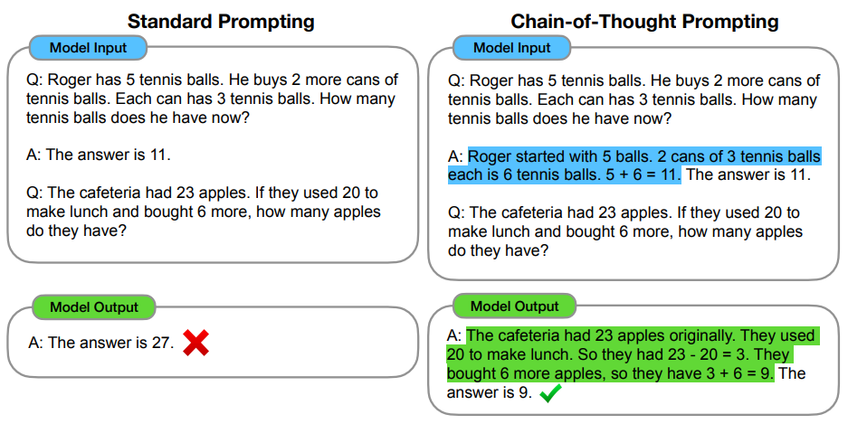
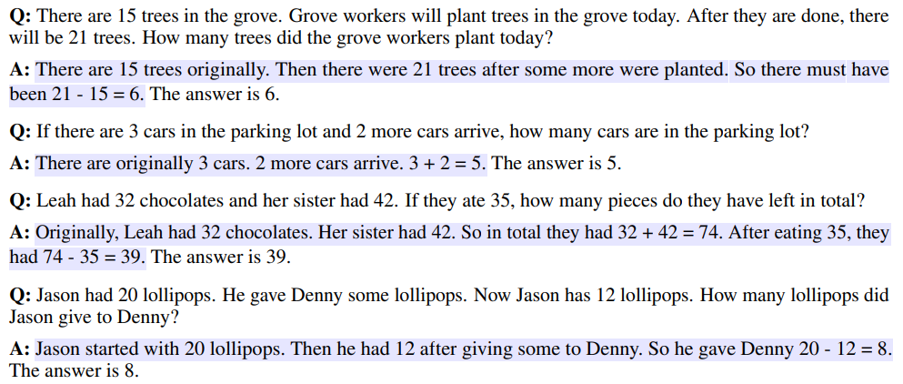
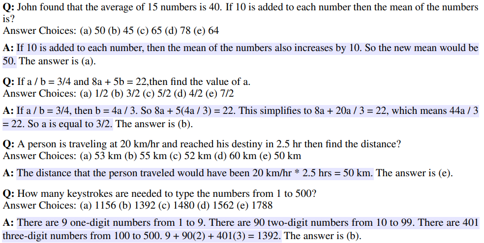
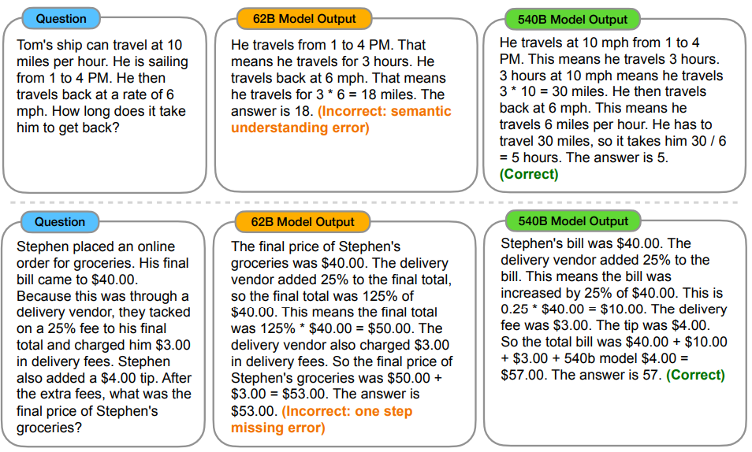
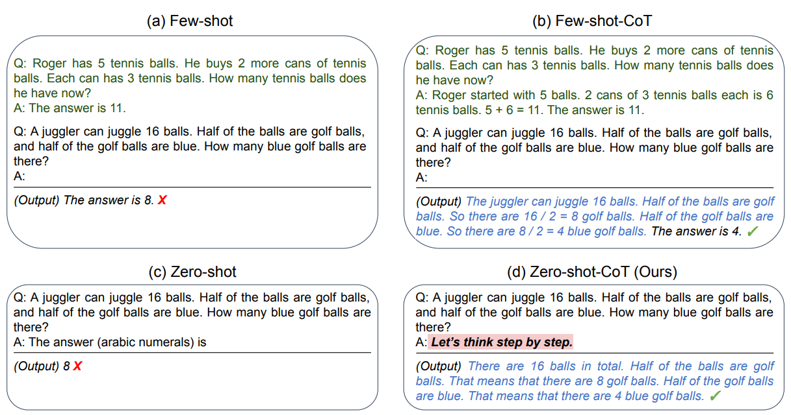
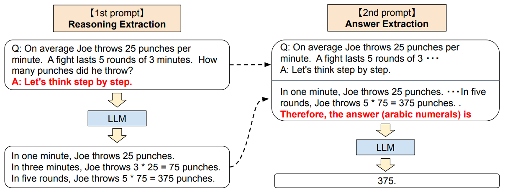
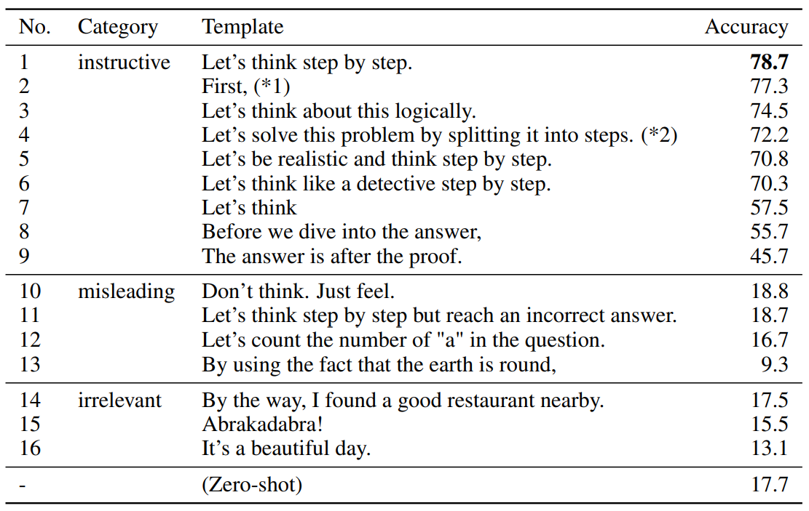
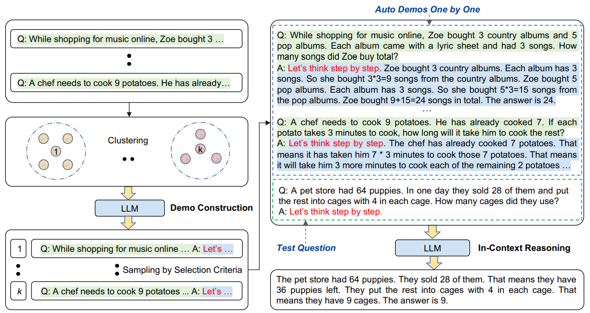

# 其一：思维链提示引发大模型的推理能力

大模型在多种任务上强大的表现已经证明了它的能力，然而，在算数、常识、符号推理等具有挑战性的任务上却没有实现高性能。大模型以“文字接龙”的形式一个一个生成token，因此输入提示对大模型的生成结果有着巨大的影响。为此，人们提出了各种增强输入提示的技巧，称为提示工程。思维链提示就是一种提示工程。

## 1. 思维链（Chain of Thought，CoT）

对于有些任务，无法简单地直接得到答案，如算数计算：可以很简单地知道”2+3”的答案是”5”，但是很难直接知道”9x8+4x6”的答案，为了得到结果，人类会一步步地求解。首先计算“9x8=72”，然后计算“4x6=24”，最后将两项相加得到最终结果“72+24=96”。Jason Wei等人提出了思维链（Chain of Thought，CoT）提示，它不是直接提供答案，而是提供一个循序渐进的推理轨迹，如上面的例子。标准的少样本提示和思维链提示都是提供几个演示示例，每个示例由问题和答案组成，不同之处在于思维链提示的答案包含求解的中间步骤，而标准提示是直接得到答案，如下图所示。



那么，包含求解步骤的思维链提示示例是从哪儿来的呢？思维链作者针对不同任务手工标注了一些示例，对于除了AQuA的数学问题，作者给出了8个示例，下面列举几个，高亮部分是求解中间步骤，特此标注出来，完整内容参见论文附录部分表20。



对于AQuA数据集，作者给出了4个示例，下面列举几个，完整内容参见论文附录部分表21。



此外，对于最后字母拼接任务的示例见表22，硬币翻转任务的示例见表23，CSQA数据集的示例见表24，StrategyQA数据集的示例见表25，日期理解任务的示例见表26，运动理解任务的示例见表27。

作者进行了一系列实验，来探究思维链提示的特性，总结为：

- 思维链提示是模型规模的涌现能力，即在小模型上，思维链提示没有积极表现，只有在大于100B参数的模型上才有性能增益。
- 思维链提示对于更复杂的问题有更大的性能提升，在简单的问题上，性能提升微乎其微，甚至是负面的。
- GPT-3 175B和PaLM 540B使用思维链提示表现优于其他微调的模型。

为了更好地理解为什么思维链提示有效，作者手动检查了LaMDA 137B在GSM8K数据集上生成的思维链。在模型返回最终答案正确的50个随机样本中，除了两个巧合地得出正确答案之外，所有生成的思维链在逻辑和数学上都是正确的。还随机检查了模型给出错误答案的50个随机样本，发现除了小错误（计算错误、符号映射错误或缺少一个推理步骤）之外，46%的思维链几乎是正确的，而另外 54% 的思维链主要错在语义理解或连贯性方面。为了深入了解为什么模型缩放可以提高思维链能力，作者通过实验观察在PaLM 62B模型上所犯的错误是否在PaLM 540B模型上得到了修复，结论是PaLM 540B模型修复了PaLM 62B模型中很大一部分的推理步骤缺失和语义理解错误。下图是两个模型生成结果的比较，更多的分析参见论文附录A.1。



是否可以通过其他类型的提示来实现相同的性能改进呢？作者尝试了几种变体：

- **仅方程式：** 思维链提示可能有帮助的一个原因是它会产生要计算的数学方程，因此测试了一种变体，其中提示给出答案之前仅输出数学方程。结论是对GSM8K数据集没有太大帮助，这是因为GSM8K数据集中问题的语义太具有挑战性，无法在没有自然语言推理步骤的情况下直接翻译成方程。但是，在只需一步或两步推理的数据集上，仅方程提示确实可以提高性能。
- **仅变量计算：** 为了将变量计算的影响与思维链推理隔离开来，作者将提示中的方程替换为 `...`序列，该点序列长度等于方程中的字符数。该变体的表现与基线大致相同，表明变量计算本身并不是思维链提示成功的原因，并且通过自然语言表达中间步骤似乎是有用的。（笔者注：似乎不应该称作仅变量计算）
- **答案后思维链：** 思维链提示的另一个潜在好处可能只是这样的提示允许模型更好地访问在预训练过程中获得的相关知识。因此，测试了一种替代配置，其中思维链提示只在答案之后给出，从而隔离模型是否真的依赖于产生的思维链来给出最终答案。这种变体的表现与基线大致相同，这表明思维链中体现的顺序推理除了激活知识之外，还有其他原因。

作者还探索了思维链提示的鲁棒性，总结如下：

- **样本顺序的敏感性：** 先前的工作表明改变样本的排列可能会导致性能巨大的差异，但是，思维链提示样本顺序在绝大多数场景下对性能没有影响，除了硬币翻转任务。
- **样本数量的影响：** 增加思维链样本的数量能够提升表现，但是进一步增加样本数量就不会有性能增益了，比如从8个样本增加到16个。
- **不同标注者：** 尽管不同的思维链标注之间存在差异，但所有的思维链提示都大大优于标准基线，这表明，思维链的成功运用并不取决于特定的语言风格。但是，不同语言风格确实会有不同的性能表现。
- **不同模型：** 在相同的提示下，除了GPT-3在CSQA和StrategyQA上的表现外，思维链提示提高了三个模型（LaMDA、GPT-3和PaLM）在所有数据集的性能。从思维链中获得的收益并没有在模型之间完美转移，还需要进一步的研究。

思维链提示并非在所有任务上都有效，当满足下列三个条件时，思维链是有帮助的：

- 任务具有挑战性，需要多步推理。
- 任务需要使用大模型来解决。
- 模型缩放曲线相对平坦。

下面通过代码来实现思维链提示。以kimi提供的api服务为例，首先需要申请[key](https://platform.moonshot.cn/console/api-keys)，然后是安装openai库：

```python
from openai import OpenAI

client = OpenAI(
    api_key = "$YOUR KEY",
    base_url = "https://api.moonshot.cn/v1",
)

question = 'Henry made two stops during his 60-mile bike trip. He first stopped after 20 miles. His second stop was 15 miles before the end of the trip. How many miles did he travel between his first and second stops'

demo = '''
Q: There are 15 trees in the grove. Grove workers will plant trees in the grove today. After they are done, there will be 21 trees. How many trees did the grove workers plant today?
A: There are 15 trees originally. Then there were 21 trees after some more were planted. So there must have been 21 - 15 = 6. The answer is 6.

Q: If there are 3 cars in the parking lot and 2 more cars arrive, how many cars are in the parking lot?
A: There are originally 3 cars. 2 more cars arrive. 3 + 2 = 5. The answer is 5.

Q: Leah had 32 chocolates and her sister had 42. If they ate 35, how many pieces do they have left in total?
A: Originally, Leah had 32 chocolates. Her sister had 42. So in total they had 32 + 42 = 74. After eating 35, they had 74 - 35 = 39. The answer is 39.

Q: Jason had 20 lollipops. He gave Denny some lollipops. Now Jason has 12 lollipops. How many lollipops did Jason give to Denny?
A: Jason started with 20 lollipops. Then he had 12 after giving some to Denny. So he gave Denny 20 - 12 = 8. The answer is 8.

Q: Shawn has five toys. For Christmas, he got two toys each from his mom and dad. How many toys does he have now?
A: Shawn started with 5 toys. If he got 2 toys each from his mom and dad, then that is 4 more toys. 5 + 4 = 9. The answer is 9.

Q: There were nine computers in the server room. Five more computers were installed each day, from monday to thursday. How many computers are now in the server room?
A: There were originally 9 computers. For each of 4 days, 5 more computers were added. So 5 * 4 = 20 computers were added. 9 + 20 is 29. The answer is 29.

Q: Michael had 58 golf balls. On tuesday, he lost 23 golf balls. On wednesday, he lost 2 more. How many golf balls did he have at the end of wednesday?
A: Michael started with 58 golf balls. After losing 23 on tuesday, he had 58 - 23 = 35. After losing 2 more, he had 35 - 2 = 33 golf balls. The answer is 33.

Q: Olivia has $23. She bought five bagels for $3 each. How much money does she have left?
A: Olivia had 23 dollars. 5 bagels for 3 dollars each will be 5 x 3 = 15 dollars. So she has 23 - 15 dollars left. 23 - 15 is 8. The answer is 8.
'''

cot_prompt = f"{demo}\nQ: {question}\nA: "

completion = client.chat.completions.create(
    model = "moonshot-v1-8k",
    messages = [
        {"role": "system", "content": "你是 Kimi，由 Moonshot AI 提供的人工智能助手，你更擅长中文和英文的对话。你会为用户提供安全，有帮助，准确的回答。同时，你会拒绝一切涉及恐怖主义，种族歧视，黄色暴力等问题的回答。Moonshot AI 为专有名词，不可翻译成其他语言。"},
        {"role": "user", "content": cot_prompt}
    ],
    temperature = 0.3,
)

print(completion.choices[0].message.content)
```

思维链提示的成功毋庸置疑，但是它需要人工手动标注推理步骤，这阻碍了它的广泛使用，针对此问题，许多方法提出了各自的解决方案。

## 2. 零样本思维链（Zero-Shot-CoT，ZS-CoT）

少样本（few-shot）提示通过在提示中添加一些演示示例来引导模型生成问题的答案，零样本（zero-shot）提示指提示中没有演示示例。少样本提示被视为解决困难问题的前提条件，在原始思维链提示工作中甚至没有零样本提示的报告。Zero-Shot-CoT是一种基于零样本提示的思维链推理提示，它与原始的思维链提示不同，因为它不需要一步一步推理的演示示例。另外，它是任务无关的，可以在各种任务中引发多步推理，而原始思维链提示如果提示示例与任务类型不匹配可能会导致性能下降。Zero-Shot-CoT方法的核心思想很简单，只是在问题后面添加 `Let’s think step by step.（让我们一步一步思考）`，如下图所示：



虽然零样本思维链提示在概念上很简单，但是它需要两次提示来分别提取推理和答案。零样本提示、少样本提示和思维链提示可以通过匹配字符串 `the answer is`来提取答案，但是零样本思维链提示无法做到，因此需要额外的提示来获取答案，如下图：



第一次提示使用 `Let's think step by step.`获取推理步骤，第二次提示的输入是第一次提示的输入加上第一次提示得到的推理步骤，然后再加上 `Therefore, the answer (arabic numerals) is`来提取答案。

接下来作者进行了各种实验来验证Zero-Shot-CoT的性能。在大多数的任务上零样本思维链提示都比零样本提示表现更好，在常识推理任务上零样本思维链提示没有性能增益，这点在原始思维链工作中也有报告。总的来说，虽然Zero-Shot-CoT的性能比少样本思维链差，但是优于标准少样本提示。此外，作者还尝试了其它的提示模板，不过 `Let’s think step by step.`是效果最好的，如下图所示：



下面通过代码实现零样本思维链提示：

```python
from openai import OpenAI

client = OpenAI(
    api_key = "$YOUR KEY",
    base_url = "https://api.moonshot.cn/v1",
)

question = 'Henry made two stops during his 60-mile bike trip. He first stopped after 20 miles. His second stop was 15 miles before the end of the trip. How many miles did he travel between his first and second stops'
# 标准提示
std_prompt = f"Q: {question}\nA: The answer (arabic numerals) is"

# 零样本思维链提示
zs_prompt = f"Q: {question}\nA: Let's think step by step."
# 步骤1：生成思维链
completion = client.chat.completions.create(
    model = "moonshot-v1-8k",
    messages = [
        {"role": "system", "content": "你是 Kimi，由 Moonshot AI 提供的人工智能助手，你更擅长中文和英文的对话。你会为用户提供安全，有帮助，准确的回答。同时，你会拒绝一切涉及恐怖主义，种族歧视，黄色暴力等问题的回答。Moonshot AI 为专有名词，不可翻译成其他语言。"},
        {"role": "user", "content": zs_prompt}
    ],
    temperature = 0.3,
)

reason = completion.choices[0].message.content

answer_prompt = zs_prompt + " " + reason + "\nTherefore, the answer (arabic numerals) is"
# 步骤2： 提取答案
completion = client.chat.completions.create(
    model = "moonshot-v1-8k",
    messages = [
        {"role": "system", "content": "你是 Kimi，由 Moonshot AI 提供的人工智能助手，你更擅长中文和英文的对话。你会为用户提供安全，有帮助，准确的回答。同时，你会拒绝一切涉及恐怖主义，种族歧视，黄色暴力等问题的回答。Moonshot AI 为专有名词，不可翻译成其他语言。"},
        {"role": "user", "content": answer_prompt}
    ],
    temperature = 0.3,
)
print(completion.choices[0].message.content)
```

## 3. Auto-CoT

标准思维链提示需要手动标注演示示例，零样本思维链提示只使用 `Let’s think step by step.`来引导逐步推理，省去了手动标注的人力，但是它的性能终究不如思维链提示，那么是否能将两种方法的优点结合起来呢？Auto-CoT利用大模型和 `Let’s think step by step.`提示生成用于演示的推理链来消除手动标注的工作。然而，这些生成的推理链经常会出现错误。作者发现，与测试问题相似的演示问题的思维链出错时，会误导大模型得到错误答案，而演示问题与测试问题不相似，即使思维链是错误的，也影响很小。因此，他们根据多样性对问题进行采样，并生成推理链来构建演示。

Auto-CoT由两个主要阶段组成：

1. **问题聚类：** 将给定数据集的问题划分为几个聚类。使用Sentence-BERT为数据集中每个问题计算矢量特征，然后使用k均值聚类算法将问题分成k个聚类。对于每个聚类中的问题，根据它们与聚类中心的距离进行升序排序。
2. **演示采样：** 从每个聚类中选择一个具有代表性的问题，并使用简单启发式的Zero-Shot-CoT生成其推理链。在第一步中已经根据问题与聚类中心的距离进行升序排序，那么该选择哪个问题呢？遍历排序后的问题，作者选择问题不多于60 token和推理链不多于5步的。因为使用Zero-Shot-CoT生成的推理链可能存在错误，作者发现长的问题和长的思维链很容易出错，因此采用这种启发式方法去除错误的演示。

流程如下图：



## 4. 参考

《[Chain-of-Thought Prompting Elicits Reasoning in Large Language Models](https://arxiv.org/abs/2201.11903)》

《[Large Language Models are Zero-Shot Reasoners](https://arxiv.org/abs/2205.11916)》【[代码](https://github.com/kojima-takeshi188/zero_shot_cot)】

《[Automatic Chain of Thought Prompting in Large Language Models](https://arxiv.org/abs/2210.03493)》【[代码](https://github.com/amazon-science/auto-cot)】
