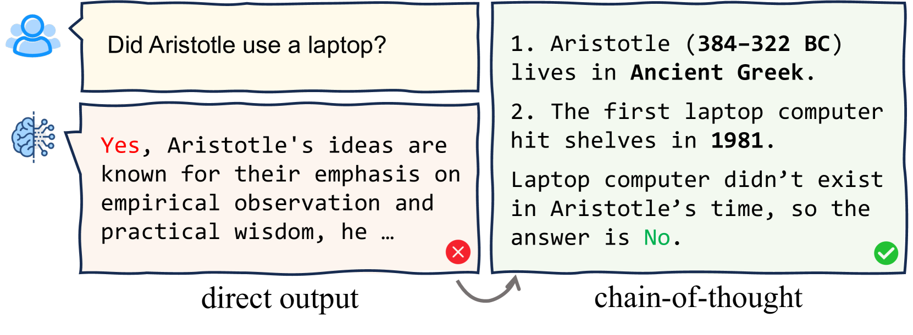
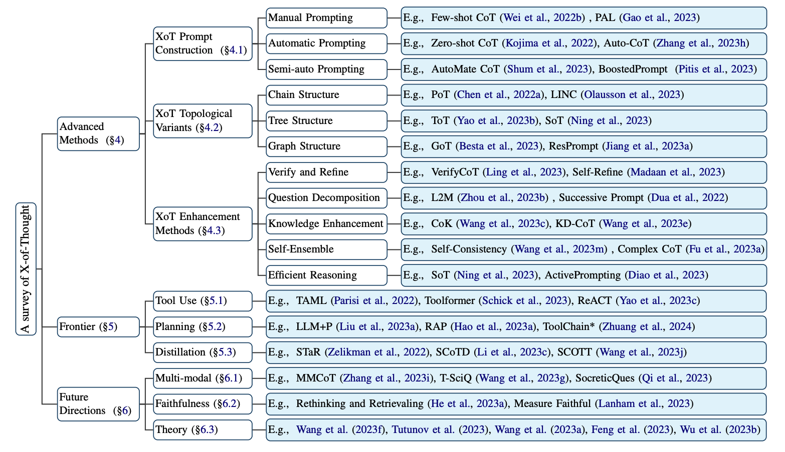
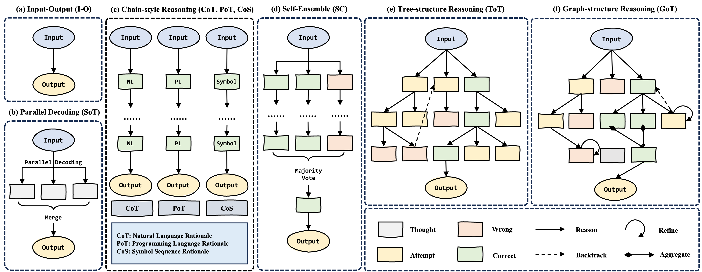
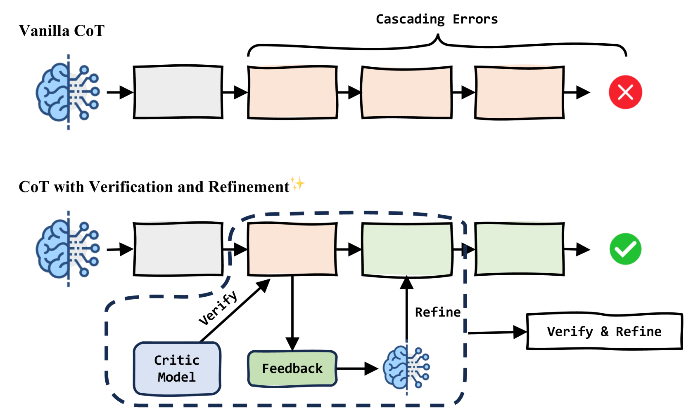
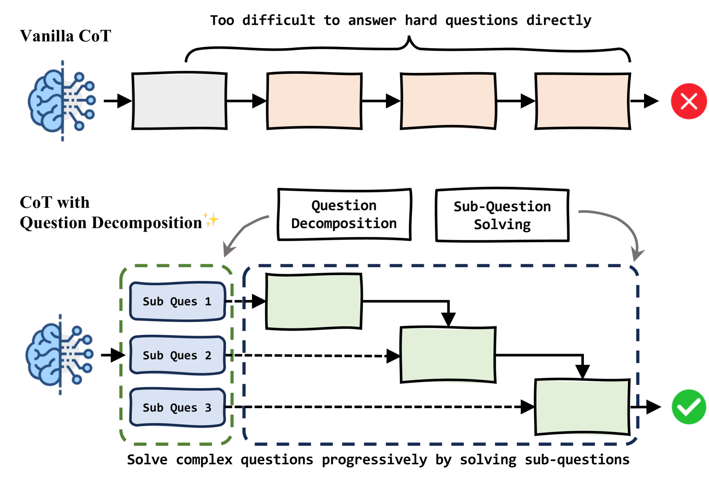
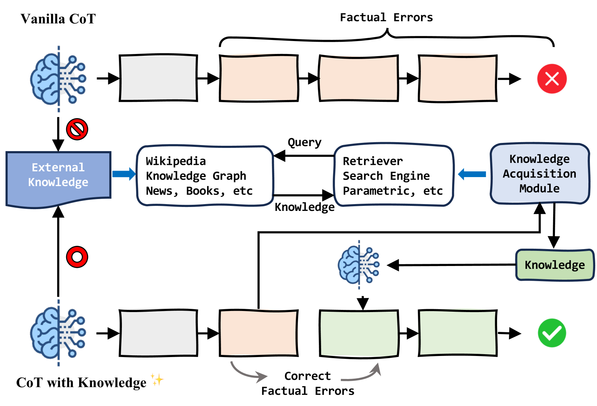
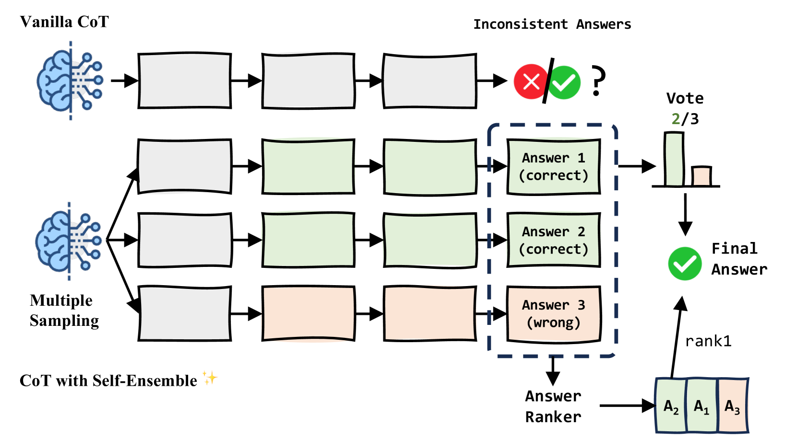

# Navigate through Enigmatic Labyrinth A Survey of Chain of Thought Reasoning: Advances, Frontiers and Future

> [本文](https://arxiv.org/pdf/2309.15402)是一篇关于思维链的综述，作者维护了一个思维链最新进展的[Github](https://github.com/zchuz/CoT-Reasoning-Survey)仓库

## 摘要

推理是人类智能不可或缺的一个基本认知过程，在人工智能领域引起了极大的兴趣。值得注意的是，最近的研究表明，思维链提示显著增强了LLM的推理能力，这引起了学术界和业界的广泛关注。在本文中，我们系统地调查了相关研究，通过细致的分类学总结了先进的方法，提供了新颖的视角。此外，我们深入研究了当前的前沿，描绘了挑战和未来的方向，从而为未来的研究提供了线索。此外，我们还就悬而未决的问题进行讨论。我们希望这篇论文能为初学者做一个介绍，并促进未来的研究。资源已公开在[https://github.com/zchuz/CoTReasoning-Survey](https://github.com/zchuz/CoT-Reasoning-Survey)。

## 1 介绍

在人类认知领域，推理是理解世界和形成决策的关键。随着预训练的规模不断扩大，大型语言模型在许多下游任务中表现出越来越强的能力。最近，研究人员发现，LLM具有通过上下文学习进行逐步推理的能力，这种现象被称为思维链（Chain of Thought，CoT）推理。人们普遍观察到，CoT提示显著提高了LLM的推理能力，尤其是在复杂任务中。

图1 模型在思维链提示的指导下，逐步解决复杂问题。

图1展示了一个思维链推理的例子。思维链推理不是直接提供答案，而是提供一个循序渐进的推理轨迹。具体而言，它将复杂的问题分解为可管理的步骤（*思维 thoughts*），简化了整个推理过程，并在推理步骤之间创建了一个链接（*链 chain*），以确保不会忽略任何重要条件。此外，思维链推理提供了一个可观察的推理过程，允许用户理解模型的决策轨迹，并提高最终答案的可信度和可解释性。

得益于CoT提示的卓越性能，它引起了学术界和工业界的广泛关注，发展成为提示工程（[Liu，2023d](https://aclanthology.org/2023.emnlp-main.169/)；[Qiao，2021](https://aclanthology.org/2023.emnlp-main.163/)）领域的一个独特研究分支。此外，它已成为AI Agent（[Wang，2023h](https://aclanthology.org/2023.acl-long.147/)；[Xi，2023](https://arxiv.org/abs/2309.07864)）的一个关键组成部分。然而，这些研究仍然缺乏系统的回顾和分析。为了填补这一空白，我们提出本工作对CoT推理进行全面而详细的分析。具体来说，本文深入研究了思维链推理的更广泛范围，我们称之为广义思维链（XoT）。XoT推理的核心哲学是通过逐步推理的方法逐步解开复杂的问题。

我们的贡献总结如下：（1） **综合调查：** 这是第一次专门针对XoT推理的综合调查；（2） **细致的分类法：** 我们引入了一种细致的分类方法（如图2所示）；（3） **前沿与未来：** 我们讨论新的前沿，概述它们的挑战，并阐明未来的研究。（4） **资源：** 我们公开提供这些资源，为研究界提供便利。
**综述组织** 我们首先给出背景和预备知识（§2）；然后从不同的角度提出基准（§3）和先进的方法（§4）。此外，我们讨论了前沿研究（§5），并概述了挑战和未来方向（§6）。最后，我们对悬而未决的问题进行了进一步的讨论（§A.2）。

## 2 背景和预备知识

### 2.1 背景

在过去几年中，随着预训练规模的不断增加，出现了具有许多新能力的语言模型，如上下文学习（[Wei，2022a](https://arxiv.org/abs/2206.07682)；[Brown，2022](https://arxiv.org/abs/2005.14165)）和思维链推理（[Wei，2022b](https://arxiv.org/abs/2201.11903)）。伴随着这一趋势，预训练再提示逐渐取代了预训练再微调，成为自然语言处理的新范式。

### 2.2 预备知识

在本节中，我们为标准提示和思维链推理提供了预备知识。参考[Qiao等人（2023）](https://arxiv.org/abs/2212.09597)，我们定义了如下符号：问题$\mathcal{Q}$、提示$\mathcal{T}$、概率语言模型$p_{LM}$和预测$\mathcal{A}$。
首先，我们考虑少样本标准提示场景，其中提示$\mathcal{T}_{SP}$包括指令$I$和少样本演示（几个问答对）。模型以问题和提示作为输入，并产生预测答案$\mathcal{A}$作为其输出，如公式（1，2）所示。

$$
\begin{align}\mathcal{T}_{SP}=\{I,(x_1,y_1),...,(x_n,y_n)\}\\ p(\mathcal{A}|\mathcal{T},\mathcal{Q})=\prod_{i=1}^{|\mathcal{A}|}p_{LM}(a_i|\mathcal{T},\mathcal{Q},a_{<i})\end{align}
$$

接下来，我们考虑在少样本设置下的思维链提示，其中提示$\mathcal{T}_{CoT}$包括指令、问题、答案和理由$e_i$。
在思维链推理中，模型不再直接生成答案。相反，它在给出答案$\mathcal{A}$之前生成逐步推理轨迹$\mathcal{R}$，如公式（3，4，5，6）所示。

$$
\begin{align}\mathcal{T}_{CoT}=\{I,(x_1,e_1,y_1),...,(x_n,e_n,y_n)\}\\ p(\mathcal{A},\mathcal{R}|\mathcal{T},\mathcal{Q})=p(\mathcal{A}|\mathcal{T},\mathcal{Q},\mathcal{R})\cdot p(\mathcal{R}|\mathcal{T},\mathcal{Q}) \\ p(\mathcal{R}|\mathcal{T},\mathcal{Q})=\prod_{i=1}^{|\mathcal{R}|}p_{LM}(r_i|\mathcal{T},\mathcal{Q},r_{<i})\\ p(\mathcal{A}|\mathcal{T},\mathcal{Q},\mathcal{R})=\prod_{j=1}^{|\mathcal{A}|}p_{LM}(a_i|\mathcal{T},\mathcal{Q},a_{<j})\end{align}
$$

### 2.3 CoT推理的优点

思维链作为一种新颖的推理范式，具有多种优点。（1） 强化推理。思维链推理将复杂的问题分解为可管理的步骤，并在这些步骤之间建立联系，从而促进推理。（2） 提供可解释性。思维链推理提供了可观察的推理轨迹，允许用户理解模型的决策，使推理过程透明可信。（3） 高级协作。细粒度的推理轨迹有助于用户与系统的交互，从而改变模型的执行轨迹，从而促进LLM驱动的自主代理的开发。

## 3 基准

在本节中，我们简要概述了评估推理能力的基准，包括数学、常识、符号、逻辑和多模态推理。基准概述如表1所示。有关基准的更多详细信息，请参阅附录B。

**数学推理（Mathematical Reasoning）** 数学推理是人类智力的基础，在解决问题、决策和理解世界方面发挥着至关重要的作用。它通常用于评估LLM的一般推理能力。

**常识推理（Commonsense Reasoning）** 常识推理对于日常生活中的互动和对世界的感知至关重要，它评估语言模型的世界理解能力。

**符号推理（Symbolic Reasoning）** 符号推理解开了语义的纠缠，并作为语言模型模拟原子操作能力的试验台。

**逻辑推理（Logical Reasoning）** 逻辑推理至关重要，因为它是理性思考、稳健解决问题和可解释决策的基石。

**多模态推理（Multi-modal Reasoning）** 多模态推理将文本思维与来自自然世界的感官体验（如视觉场景和听觉声音）无缝集成，以创造对信息更丰富、更全面的理解。

## 4 先进方法

本节从三个角度讨论了先进的XoT方法：提示构建（§4.1）、拓扑变体（§4.2）和改进方法（§4.3）。分类法如图2所示。

图2 先进方法的分类、前沿和未来方向（完全版见论文附录中的图8）

### 4.1 XoT提示构建

基于构建思维提示链的人类努力，我们将构建方法分为三类：1）手动XoT，2）自动XoT和3）半自动XoT。

### 4.1.1 手动提示

[Wei等人（2022b）](https://arxiv.org/abs/2201.11903)首先提出了通过手动标注自然语言形式的推理步骤来指导模型逐步推理。此外，[Fu等人（2023a）](https://arxiv.org/abs/2301.12726)发现，使用复杂的推理链作为演示可以进一步提高推理性能。然而，NL形式推理遇到了不一致推理。为了减少推理中的中间错误，[PAL（Gao，2023）](https://arxiv.org/abs/2211.10435)、[PoT（Chen，2022a）](https://arxiv.org/abs/2211.12588)、[MathPrompt（Imani，2022）](https://arxiv.org/abs/2303.05398)和[NLEP（Zhang，2023d）](https://arxiv.org/abs/2309.10814)利用编程语言形式，将解决问题转化为程序生成，并通过外部程序执行器获得确定性答案。尽管手动XoT展示了更好的性能，但对推理的标注导致了成本的显著增加，并在演示选择中引入了困难。

### 4.1.2 自动提示

一些工作设计了特定的指令来激励零样本下的CoT推理，例如在问题后附加“*让我们一步一步地思考（Let’s think step by step）*”（[Kojima，2022](https://arxiv.org/abs/2205.11916)）。还有其他类型的指令，包括编写解决问题的程序（[Chen，2022a](https://arxiv.org/abs/2211.12588)）、在推理之前起草计划（[Wang，2023i](https://arxiv.org/abs/2305.01879)）、基于任务信息生成元指令（[Crispino，2023](https://arxiv.org/abs/2310.03710)）和角色扮演（[Kong，2023a](https://arxiv.org/abs/2308.07702)）。

然而，由于缺乏明确定义的演示的指导，基于指令的方法显得极不稳定。另一种途径是基于自动生成的推理（通常通过零样本CoT）进行少样本推理，这提高了推理的稳定性。这些方法侧重于选择适当的演示。[Zhang等（2023h）](https://arxiv.org/abs/2210.03493)通过聚类选择不同的推理演示，[Zou等（2023）](https://arxiv.org/abs/2310.06692)基于问题模式构建演示，提高了泛化能力，[Wan等（2023）](https://arxiv.org/abs/2305.14106)采用答案熵作为选择的度量，[Xu等（2023）](https://arxiv.org/abs/2305.09993)采用吉布斯抽样迭代选择演示。

### 4.1.3 半自动提示

在基于少样本学习的自动XoT的基础上，半自动方法结合了少量人工标注的推理来获得监督信号。他们专注于引导以获得高质量的推理，并选择适当的演示来促进推理。[Shao等人（2023b）](https://arxiv.org/abs/2302.00618)通过交替的正向和反向合成过程产生了高质量的推理，[Pitis等人（2023）](https://arxiv.org/abs/2304.05970)在遇到具有挑战性的问题时迭代扩展了示例，这缓解了人类监督有限的问题。另一方面，一些研究优化了演示选择。[Shum等人（2023）](https://arxiv.org/abs/2302.12822)和[Lu等人（2023b）](https://arxiv.org/abs/2209.14610)利用策略梯度优化来学习演示选择策略，而[Ye和Durrett（2023）](https://arxiv.org/abs/2302.04813)搜索开发集并使用两个代理度量选择适当的演示。

### 4.1.4 三种方法的优缺点

手动提示依赖于高质量的推理标注，从而获得更好的性能。然而，它也面临着人力成本高和领域迁移挑战等缺点。相比之下，自动提示不产生人工成本，并且便于领域迁移。然而，由于缺乏监督信号，它受到误差和不稳定性的困扰。半自动提示实现了平衡，实现了性能和成本之间的权衡，使其更适合下游应用。

### 4.2 XoT拓扑变体

XoT的演进导致了多种拓扑变体的发展。在本节中，我们将深入研究XoT的拓扑变体：链结构、树结构和图结构。

图3 XoT演进中出现的拓扑变体。（a） 标准I-O提示，（b）并行约束树结构变体，（c）不同描述的链结构变体，（d） 具有自集成的链结构变体，（e）标准树结构变体，和（f）标准图结构变体。

**链结构（Chain Structure）** 推理的描述格式对推理的执行有显著影响。[PAL（Gao，2023）](https://arxiv.org/abs/2211.10435)和[PoT（Chen，2022a）](https://arxiv.org/abs/2211.12588)使用编程语言来描述推理过程，将解决问题转化为代码生成。类似地，形式逻辑描述语言也用于描述逻辑推理（[Olausson，2023](https://arxiv.org/abs/2310.15164)；[Pan，2021](https://arxiv.org/abs/2305.12295)；[Ye，2023a](https://arxiv.org/abs/2305.09656)）。上述方法将思维生成与执行解耦，从而消除不一致推理错误。此外，算法描述（[Sel，2023](https://arxiv.org/abs/2308.10379)）可以提供一个高层级推理框架，而不是细节，赋予模型全局思维的能力。

**树结构（Tree Structure）** 链结构本质上限制了探索的范围。通过结合树结构和搜索算法，模型能够在推理过程中进行广泛的探索和回溯（[Long，2023](https://arxiv.org/abs/2305.08291)；[Yao，2023b](https://arxiv.org/abs/2305.10601)），如图3（e）所示。[Chen等人（2024）](https://arxiv.org/abs/2402.11140)反复探索和评估多个思维树，以进一步增强推理能力。得益于这一探索，树变体已经获得了初步的全局规划能力，以实现全局最优。同时，[Mo和Xin（2023）](https://arxiv.org/abs/2309.07694)；[Cao等人（2023）](https://arxiv.org/abs/2311.13982)分别引入了基于蒙特卡罗丢弃和生成似然的不确定性度量，从而对中间推理过程提供了更准确的评估。[Yu等人（2024）](https://arxiv.org/abs/2310.03965)使用自下而上的方法构建类比子问题树。此外，[Ning等人（2023）](https://arxiv.org/abs/2307.15337)最初提供推理草稿，通过并行解决树结构子问题来加速推理。然而，基于树的方法受到显式问题分解和状态转换需求的限制，这导致了任务泛化的局限性。

**图结构（Graph Structure）** 图结构引入了循环和N对1连接，从而改进了子问题聚合和自验证（[Besta，2023](https://arxiv.org/abs/2308.09687)；[Lei，2023a](https://arxiv.org/abs/2308.08614)）的建模，如图3（f）所示。在处理复杂问题时，图结构优于基于树的方法。然而，它们依赖于专门设计的状态分解，导致泛化能力较差。为了解决这一问题，[Jiang等人（2023a）](https://arxiv.org/abs/2310.04743)通过提示在推理过程中建立了一个隐式图，避免了显式拓扑结构的约束，从而推广到各种多步骤推理任务中。

复杂的拓扑结构引入了精细的控制流，这有助于LLM解决更棘手的问题。然而，这种复杂性也限制了这些方法在一般推理中的应用，这是一个需要在未来研究中解决的重大挑战。

## 4.3 XoT改进方法

本节介绍了五种改进的XoT推理方法，包括验证和优化（§4.3.1）、问题分解（§4.3.2）、知识增强（§4.3.3）、自集成（§4.3.4）和高效推理（§4.3.5）。

### 4.3.1 验证和优化

图4 验证和优化可以纠正中间错误，从而减少推理中的级联错误。

LLM倾向于产生幻觉，表现为推理中的事实错误和忠实错误（[Huang，2023b](https://arxiv.org/abs/2311.05232)）。将验证和优化结合起来可以成为缓解这种现象的有效战略。在本节中，我们主要关注减轻忠实错误，并在以下知识增强部分（§4.3.3）中单独讨论事实错误。

推理可以根据LLM提供的关键反馈进行改进。[Paul等人（2024a）](https://arxiv.org/abs/2304.01904)训练一个小的批评者模型来提供结构化反馈，但由于模型的大小，反馈的质量受到限制。[Madaan等人（2023）](https://arxiv.org/abs/2303.17651)使用来自自身的反馈进行迭代自优化，[Li等人（2023g）](https://arxiv.org/abs/2206.02336)在步骤级别使用更细粒度的反馈，[Shinn等人（2023）](https://arxiv.org/abs/2303.11366)通过结合长短期记忆来进一步扩展该方法，以提供更简洁的反馈。然而，最近的研究表明，LLM可能无法解决超出其自身能力的问题（[Kadavath，2022](https://arxiv.org/abs/2207.05221)；[Yin，2023](https://arxiv.org/abs/2305.18153)），这让人们对自我反馈的有效性产生了怀疑（[Huang，2024a](https://arxiv.org/abs/2310.01798)）。为了弥补这一点，一些工作结合了外部反馈（[Gou，2024a](https://arxiv.org/abs/2305.11738)；[Nathani，2023](https://aclanthology.org/2023.emnlp-main.407.pdf)）或对优化的推理进行二次验证（[Shridhar，2023](https://arxiv.org/abs/2309.13075)）。

另一方面，逻辑推理结构也非常适合验证。[Ling等人（2023）](https://arxiv.org/abs/2306.03872)设计了一种名为“自然程序（Natural Program）”的演绎推理形式，它保证了结论是从指定的前提得出的。[Wu等人（2024）](https://arxiv.org/abs/2403.19167)应用演绎滤波器来验证问题和推理链之间的隐含关系。一些研究在波束搜索解码阶段执行逐步验证。[Xie等人（2023）](https://arxiv.org/abs/2305.00633)使用演绎推理的对数概率作为搜索标准，而[Zhu等人（2024a）](https://arxiv.org/abs/2401.17686)训练演绎鉴别器进行验证。此外，反向（溯因）推理擅长于检测推理中的不一致性。它基于推理链重构问题中的条件或变量，以发现不一致之处，从而完善推理（[Xue，2023](https://arxiv.org/abs/2305.11499)；[Weng，2022](https://arxiv.org/abs/2212.09561)；[Jiang，2023b](https://arxiv.org/abs/2308.07758)）。

LLM推理容易产生幻觉，而来自中间步骤的反馈在完善推理中起着至关重要的作用。然而，目前反馈信号的采集仍存在许多不足，需要进一步研究。

### 4.3.2 问题分解

图5 问题分解通过解决简单的子问题逐步解决复杂问题。

XoT的哲学是循序渐进地解决问题。然而，标准CoT并没有明确地分解问题，这使得回答复杂的问题变得很有挑战性。为了解决这一问题，某些方法通过逐步解决简单的子问题来解决复杂的问题。

[L2M（Zhou，2023b）](https://arxiv.org/abs/2205.10625)最初以自上而下的方式将问题分解为子问题。然后，它一次解决一个子问题，并利用其解决方案来促进后续的子问题。[Dua等人（2022）](https://arxiv.org/abs/2212.04092)采用了与L2M类似的方法，但它使用先前子问题的解决方案来迭代分解问题。[Khot等人（2023）](https://arxiv.org/abs/2210.02406)设计了一个模块化任务共享库，为不同类别的子问题量身定制更有效的解决方案。[Huang等人（2024b）](https://aclanthology.org/2024.lrec-main.1173/)将问题分解为以QDMR为代表的有向无环图，然后基于图的依赖性进行逐步推理。在多步推理中，迭代分解已成为一种常见的实践（[Wang ，2022](https://arxiv.org/abs/2203.08383)；[Press，2023](https://arxiv.org/abs/2210.03350)；[Trivedi，2023](https://arxiv.org/abs/2212.10509)）。此外，一些方法通过监督训练而不是依赖LLM本身来获得专门的分解器（[Li，2023f](https://arxiv.org/abs/2305.13269)；[Junbing，2023](https://arxiv.org/abs/2311.06754)）。然而，在处理表格推理时，回答子问题也可能带来挑战，尤其是在处理大表时。为了解决这个问题，某些方法需要同时分解问题和表格（[Ye，2023b](https://arxiv.org/abs/2301.13808)；[Cheng，2023](https://arxiv.org/abs/2210.02875)；[Nahid和Rafiei，2024](https://arxiv.org/abs/2404.10150)）。

自下而上的聚合也是一种可行的解决方案，具有较小的探索空间。[Qi等人（2023）](https://arxiv.org/abs/2305.14999)采用苏格拉底式提问进行递归自提问来解决复杂问题，而[Zhang等人（2024）](https://arxiv.org/abs/2308.04371)以类似的方式，将复杂问题的条件分解为小的组成部分，并自下而上地解决它们。

应该注意的是，分解和聚合都高度依赖于正确的问题划分，相反，不对齐的划分可能会产生适得其反的结果。

### 4.3.3 知识增强

图6 整合知识（内部或外部）有助于减少推理中的事实错误

在处理知识敏感的任务时，LLM经常会犯事实错误。引入外部知识或挖掘模型的内部知识可以帮助缓解这个问题。一些方法明确地利用了模型的内在知识。例如，[Dhuliawala等人（2023）](https://arxiv.org/abs/2309.11495)、[Ji等人（2023）](https://arxiv.org/abs/2310.06271)、[Zheng等人（2024）](https://arxiv.org/abs/2310.06117)提示模型输出其参数化知识，然后据此推理。此外，[Zhang等人（2023f）](https://arxiv.org/abs/2311.18397)提示模型对其内部知识进行归纳推理，得出更通用的结论。此外，Liu等人（2023c）结合强化学习来优化基于内省知识的推理。同时，[Li和Qiu（2023）](https://arxiv.org/abs/2305.05181)利用模型的推理轨迹来构建记忆库，在需要时选择相关的演示。

外部知识往往比参数知识更可靠。[Li等（2023f）](https://arxiv.org/abs/2305.13269)、[Wang等（2023e）](https://arxiv.org/abs/2308.13259)利用知识库作为外部知识，基于该问题生成查询。在此基础上，[Wang等人（2023c）](https://arxiv.org/abs/2306.06427)引入了检索到的知识的验证步骤，进一步确保了知识的准确性。然而，当面对多步推理时，使用该问题进行直接检索可能是不够的。因此[Press等人（2023）](https://arxiv.org/abs/2210.03350)、[Trivedi等人(2023)](https://arxiv.org/abs/2212.10509)、[Shao等人（2023a）](https://arxiv.org/abs/2305.15294)、[Yoran等人（2023）](https://arxiv.org/abs/2304.13007)对问题进行分解，并迭代使用子问题进行更精确的检索。

### 4.3.4 自集成

图7 自集成通过从多个样本中选择最终答案来减少不一致性。

生成过程中的采样引入了不确定性，这反过来又创造了通过自集成提高性能的可能性。[Cobbe等人（2021）](https://arxiv.org/abs/2110.14168)训练验证器对答案进行排序，[Hu等人（2024a）](https://arxiv.org/abs/2403.12373)利用LLM对其预测进行自排序。SC（[Wang ，2023m](https://arxiv.org/abs/2203.11171)）基于多个样本的答案进行多数投票，[Fu等人（2023a）](https://arxiv.org/abs/2210.00720)在SC之上提出了一种基于复杂度的投票策略。广泛的实践证据表明，自集成是提高性能的有效途径。然而，基于答案的集成没有考虑中间步骤。作为回应，[Miao等人(2024)](https://arxiv.org/abs/2308.00436)、[Yoran等人（2023）](https://arxiv.org/abs/2304.13007)、[Khalifa等人（2023）](https://arxiv.org/abs/2305.14934)在步骤级别上改进了集成。[Yin等人（2024）](https://arxiv.org/abs/2405.12939v1)引入了分层答案聚合。另一个需要关注的问题是概率抽样导致的有限多样性。为了克服这一限制，[Naik等人（2023）](https://arxiv.org/abs/2310.07088)使用了不同的指令，[Liu等人（2023e）](https://arxiv.org/abs/2310.14628)集成了各种XoT变体，[Qin等人（2023）](https://arxiv.org/abs/2310.14799)使用多语言推理链集成。此外，多智能体辩论（MAD）框架也可以被视为异构集成（[Liang，2023](https://arxiv.org/abs/2305.19118)；[Du，2021](https://arxiv.org/abs/2305.14325)；[Wang，2023b](https://arxiv.org/abs/2312.04854)）。

自集成作为一种简单有效的手段，得到了广泛的青睐。然而，随着性能的提高，推理成本成倍增加，这反过来限制了它的广泛应用。

### 4.3.5 高效推理

LLM在推理方面通常效率低下，例如高延迟、大量的标注成本和较高的推理成本。为了加快推理速度，[Ning等人（2023）](https://arxiv.org/abs/2307.15337)将问题并行分解并同时处理，[Zhang等人（2023b）](https://arxiv.org/abs/2309.08168)生成草案以在推理过程中跳过中间层，以及[Leviathan等人（2023）](https://arxiv.org/abs/2211.17192)、[Chen等人（2023a）](https://arxiv.org/abs/2302.01318)介绍了推测解码，它采用较小的模型进行更快的推理。[Diao等人（2023）](https://arxiv.org/abs/2302.12246)标注高不确定性样本以降低人力成本，[Aggarwal等人（2023）](https://arxiv.org/abs/2305.11860)动态调整采样频率以降低推理成本。进一步的研究应侧重于高效的推理，以促进LLM的广泛应用。

## 5 研究前沿

### 5.1 工具使用

LLM在获取新闻、执行计算和与环境交互方面面临困难。先前的工作赋予LLM使用外部工具的能力，增强了它们的推理能力，使它们能够与（多模态）外部环境交互（Parisi，2022；Schick，2023；Shen，2023a）。

但是，这些方法在促进多个工具调用和更正查询错误方面存在局限性。为了解决这个问题，ReAct（Yao，2023c）和Reflexion（Shinn，2023）融合了推理和行动的优势，相辅相成。ART（Paranjape，2023）使用任务库来选择相关工具和推理演示。MM-REACT（Yang，2023b）进一步融合了视觉专家，以促进多模态推理和行动。

上述研究侧重于利用外部工具赋予LLM最初所缺乏的能力，从而提高其在各个领域的性能。工具调用促进了与外部来源的交互，使其能够收集额外的信息，而XoT能够实现有效的启发、跟踪和动作优化。

### 5.2 规划

LLM很难为复杂的目标提供准确的响应，这需要规划将其分解为子任务并跟踪执行过程。规划可以用代码或定义语言进行描述。Sun等人（2023）生成Python代码来控制代理，并根据执行反馈迭代完善规划。Liu等（2023a）、Dagan等人（2023）利用规划领域定义语言（PDDL）（Gerevini，2020）来描述规划过程。PDDL有助于分解复杂的问题，并在将结果转换为自然语言之前利用专门的模型进行规划。Zhou等人（2023d）将自优化（Madaan，2023）与PDDL相结合，以在长期序列任务中实现更好的成功率。

许多研究使用搜索算法来动态规划和探索行动空间，而不是预定义的规划。思维树通过DFS或BFS搜索来探索问题，并跟踪和更新中间状态（Yao，2023b）。RAP和LATS在规划中结合了基于推理轨迹的蒙特卡罗树搜索（Hao，2023a；Zhou，2023a），ToolChain*通过启发式A*搜索实现了更高效的探索（Zhuang，2024）。

LLM具有强大的推理能力，可以制定实现复杂目标的策略。此外，规划、推理、记忆和工具使用的集成是LLM驱动的自主代理的基石。

### 5.3 推理能力蒸馏

在边缘计算等低资源场景中，蒸馏提供了部署LLM的可能性。有些方法在没有外部监督的情况下采用自蒸馏进行自我改进。Huang（2023a）利用自一致性从未标记的数据中生成推理链，然后进行微调，增强其广义推理能力。Zelikman等人（2022）通过自循环自举提高了LM的推理能力。

尽管CoT表现出强大的推理能力，但它主要出现在大型LLM中，在较小的模型中使用有限。Magister等人（2023）发现，在对CoT推理数据进行微调后，较小的模型也可以表现出逐步推理的能力。遵循这一趋势，许多研究试图将LLM的逐步推理能力提炼到更小的模型。Hsieh等人（2023b）使用自一致性来过滤预测，从LLM中提取高质量的推理链。Ho等人（2023）、Li等人（2023c）发现，每个实例采样多个推理链对提高学生的推理能力至关重要。SCOTT（Wang，2023j）利用对比解码和反事实推理目标来解决捷径问题。Li等人（2024）通过LoRA专家混合蒸馏提高了对未见任务推理的泛化能力。

最近的研究发现，通过优化偏好数据，可以进一步提高小模型的推理能力。DialCoT（Han，2023）将推理步骤分解为多轮对话，并使用PPO优化正确的推理轨迹。Wang等人（2023k）、Feng等人（2024）在自动生成的数据上训练奖励模型，该模型旨在对LLM的推理轨迹进行排序，然后使用PPO优化较小的模型。Xie等人（2024）利用蒙特卡罗树搜索对推理轨迹进行采样和评分，动态生成偏好数据，并使用DPO进行在线偏好优化。

由于代码是推理的优秀中间表示，Zhu等人（2023）将程序辅助推理能力提取到更小的模型中。同时，一些研究发现，从自然语言和代码格式中提取推理链可以带来进一步的改进（Li，2023a；Zhu ，2024b）。除了常规推理外，Yang等人（2024a）试图蒸馏表格推理能力，Zhao等人（2024b）试图赋予较小的模型检索增强的推理能力。

这些研究采用了一种共享的范式，即从具有卓越推理能力的较大模型中蒸馏具有推理链的较小模型。然而，值得注意的是，语言模型具有与多维能力相关的复杂权衡，蒸馏特定任务的推理能力可能会对总体性能产生不利影响（Fu，2023b）。

## 6 未来方向

尽管XoT推理在许多任务中表现出了非凡的性能，但仍有一些挑战需要进一步研究。

### 6.1 多模态推理

当前的XoT研究主要集中在纯文本上。然而，与现实世界的互动需要多模态的能力。为了便于研究，引入了SciQA（Lu，2022）和CURE（Chen，2023c）来强调多模态CoT推理。通过视觉与语言特征相结合的微调，Zhang等（2023i）、Wang等人（2023g）赋予模型多模态CoT推理能力，Yao等人（2023d，a）进一步结合图结构对多步关系进行建模。其他方法将图像转换为描述，并使用LLM进行基于提示的推理（Yang，2023b；Zheng，2023b）。然而，视觉语言模型的有限能力限制了它们在多步推理中的性能（Alayrac，2022；Li，2023b；Peng，2023）。

在未来的研究中，仍有几个关键挑战有待解决，我们总结如下：（1）视觉-文本交互：如何有效地整合视觉和文本特征，而不仅仅依赖于文本？（2） 利用VLLM：我们如何更好地将基于LLM的推理技术应用于多模态领域？（3） 视频推理：如何扩展到具有复杂时间依赖性的视频推理？

### 6.2 忠实推理

大量研究表明，LLM经常进行不忠实的推理，如事实错误和不一致的推理。为了解决事实错误，一种常见的方法是检索增强，但它需要适当的时间和检索准确性。与事实错误相比，不一致更难识别（Paul，2024b）。常见的检测方法包括演绎逻辑（Jiang，2023b；Xue，2023；Ling，2023）、后处理（He，2023a；Lei，2023b）和基于评论家的方法（Madaan，2023%；Nathani，2023）。其中，神经符号推理（Chen，2022a；Olausson，2023）是一种广泛使用的减少不一致性的方法，问题分解（Radhakrishnan，2023）也在一定程度上证明了其有效性。此外，Zhang等人（2023c）、Lanham等人（2023）从实证的角度研究了影响忠实的因素。

忠实推理面临两个重大挑战：（1）检测：如何准确识别不忠实推理？（2） 更正：如何获得准确的反馈并根据反馈做出正确的改进？

### 6.3 理论视角

到目前为止，CoT和ICL背后的机制尚未得到明确解释。一些研究实证探索了CoT和ICL在推理中的作用，提供了实用的见解（[Wang，2023a](https://arxiv.org/abs/2212.10001)；[Madaan和Yazdanbakhsh，2022](https://arxiv.org/abs/2209.07686)；[Tang，2023](https://arxiv.org/abs/2305.14825)）。另一条工作线从理论角度进行探索。[Li等（2023h）](https://arxiv.org/abs/2305.18869)、[Feng等(2023)](https://arxiv.org/abs/2305.15408)、[Merrill和Sabharwal（2023）](https://arxiv.org/abs/2310.07923)、[Prystawski等人（2023）](https://arxiv.org/abs/2304.03843)研究了CoT增强推理能力的原因，而[Wu等人（2023b）](https://arxiv.org/abs/2307.13339)、[Tutunov等人(2023)](https://arxiv.org/abs/2310.13571)、[Hou等人（2023）](https://arxiv.org/abs/2310.14491)、[Wang等人（2023f）](https://arxiv.org/abs/2305.14160)从基于特征的角度（信息流、注意力、变量等）研究了机制。此外，还对涌现机制进行了初步探索（Schaeffer，2023；Zhou，2023c）。

目前，CoT理论的探索还局限于表面层面。仍有悬而未决的问题需要进一步深入调查。（1） 涌现能力是如何产生的？（2） 与标准的少样本提示相比，CoT在哪些方面增强了推理能力？

## 7 讨论

我们深入研究了关于思维链推理的开放性问题，详细讨论见附录A.2。讨论包括三个主题：（a）大规模预训练如何产生思维链推理能力？（b） 如何为模型的推理和决策提供准确的反馈。（c） 思维链推理对LLM驱动的自主代理和AGI的启示。

## 8 结论

在本文中，我们对广义思维链推理的现有研究进行了系统的综述，对该领域进行了全面的回顾。具体来说，我们仔细地对先进方法进行分类，深入研究当前的前沿研究，突出现有的挑战，确定未来潜在的研究方向，并讨论悬而未决的问题。本文是第一篇专门研究CoT推理的系统综述。我们希望这项调查将有助于这一领域的进一步研究。

## 局限

本研究首次对广义思维链（XoT）推理进行了全面的综述。相关工作、基准细节和进一步讨论见附录A、B。

我们已经尽了最大努力，但可能仍有一些局限性。一方面，由于篇幅限制，我们只能提供每种方法的简要摘要，而没有详尽的技术细节。另一方面，我们主要收集来自ACL、NeurIPS、ICLR、ICML、COLING和arXiv的研究，我们可能错过了在其他场所发表的一些重要工作。在基准测试部分，我们主要列出了广泛使用的数据集，更完整的基准测试可以在Guo等人（2023）中找到。到目前为止，还没有关于未决问题的明确结论。我们将随时了解研究界的讨论情况，更新意见，并在未来补充被忽视的工作。

## A 附录

### A.1 相关调查

Zhao等人（2023b）主要关注LLM的发展，而Qiu等人（2020）关注早期PLM的调查。一些工作讨论了特定领域的推理，如数学推理（Lu，2023c）、常识推理（Talmor，2019）和逻辑推理（Yang，2023c）。Huang等（2023b）、Zhang等人（2023e）对LLM推理中潜在的幻觉现象进行了研究。Dong等人（2023）讨论了LLM时代的上下文学习技术，Yu等人（2023a）对自然语言推理进行了宏观研究。Liu等（2023d）讨论了提示微调，Qiao等（2023）、Yu等（2023c）、Huang和Chang（2023）专注于提示工程和推理策略，Zhang等人（2023g）强调了从思维链推理到自主智能体的发展。这个[仓库](https://github.com/Timothyxxx/Chain-of-ThoughtsPapers)还收集了思维链推理论文。

与上述调查不同，本文主要研究LLM时代的广义思维链推理。这是对XoT推理的首次系统研究，我们希望我们的工作能作为一个概述，以促进未来的研究。

### A.2 进一步讨论

**开放问题：CoT能力是否源于代码数据预训练？**这是一个悬而未决的问题，最初由Fu和Khot（2022）总结，并在研究界广泛流传。在早期阶段，像GPT3（davinci）和OPT这样的LLM通常不具备CoT能力，并且它们在预训练期间不使用或只包含少量代码数据。最近的模型通常在预训练期间包含专门的代码数据，如GPT-3.5、LLaMA2（在预训练过程中约有8%的代码数据），并且它们都具有强大的CoT能力。此外，Gao等人（2023）、Chen等人（2022a）发现，使用编程语言形式推理可以显著提高模型在复杂推理任务中的性能。各种迹象表明，CoT能力的来源在于预训练期间的代码数据。

最近，Ma等人（2024）研究了代码数据对不同训练阶段LLM的影响，得出了第一个由定量实验结果支持的定性结论。他们发现，在预训练阶段混合代码数据可以增强一般推理能力，而在指令微调阶段这样做可以增强特定任务的推理能力。

**开放问题：如何对模型的推理或决策提供精确的反馈？**在处理多步推理或决策任务时，错误通常发生在中间步骤，如果不及时纠正这些错误，可能会导致级联错误。目前，获得反馈的主要方法包括来自模型本身的反馈，来自其他模型的反馈，来自外部环境的反馈，以及基于强化学习的反馈。然而，一些研究对LLM提供自我反馈的能力提出了质疑。一般来说，目前的方法存在某些问题。（1） 模型本身产生的反馈有多可靠？（2） 来自其他语言模型的反馈和自我反馈之间有根本区别吗？（3） 反馈质量是否仍然受到模型能力边界的约束？（4） 如何预定义各种场景的外部反馈，以及如何将其扩展到不同的场景？
总之，目前还没有完全令人满意的反馈方法，需要更多的研究关注如何从模型的中间推理中准确地获得反馈信号。

**讨论：实现（早期）AGI** AGI是人工智能领域长期以来的终极愿望。最近对LLM驱动的自主代理的研究成功地证明了新生的通用人工智能（AGI）的初步实现。

**推理和交互之间的协同作用。**LLM具有强大的语言理解能力，可以使用插件（工具、知识库查询、搜索引擎等）通过基于文本的交互与外部世界进行交互。结合强大的推理能力，LLM在各种规划和决策任务中取得了重大进展，催化了基于LLM的自主代理的研究。

**LLM充当大脑（控制器）。**与专注于特定任务的传统人工智能相比，AGI寻求理解通用任务的能力，涵盖了广泛的领域。在LLM驱动的人工智能中，LLM通常充当大脑（或中央控制器），处理推理、规划和决策，同时将特定执行委派给专用模块（工具、弱人工智能等）。LLM驱动的人工智能已经与弱人工智能明显不同，并正在向人类认知和思维方向发展。
虽然一些研究表明LLM代表AGI的早期表现，也有学者认为，由于自回归建模和有限记忆等因素，LLM可能不会发展为AGI。截至目前，LLM是否能演变成AGI仍存在激烈的争论。但无论如何，LLM驱动的人工智能已经走上了一条与传统人工智能截然不同的道路，朝着更普遍的方向发展。

### A.3 早期在特定领域的尝试和努力

在本节中，我们列出了XoT推理的早期尝试以及专注于特定领域的努力。
在CoT的概念被引入之前，人们已经做出了一些努力，通过使用推理原理来提高推理性能。之后，某些工作已经实证证明了思维链提示的有效性（Lampinen，2022；Ye和Durrett，2022；Arora，2023）和Shi等人（2023）探索了多语言CoT推理。其他工作集中在特定领域，如机器翻译（He，2023b）、情感分析（Fei，2023）、句子嵌入（Zhang，2023a）、总结（Wang，2023n；Zhang（2022a）、算术（Lee和Kim，2023）、表格推理（Chen，2023；Ziqi和Lu，2023）、后门攻击（Xiang，2024）等。Katz等人（2022）、Zhang等人（2022a）提供了基准和资源。此外，一些研究利用特定的预训练来增强推理（Lewkowycz，2022；Zhao，2022）。

### A.4 实验结果

我们统计了各种XoT方法在数学、常识和符号推理中的性能，如表2所示。我们主要收集GPT系列模型的性能，结果主要来自相应的论文（一些结果在其他论文中用作基线）。值得注意的是，由于模型检查点和实验设置的变化，即使是具有相同骨干LLM的方法也可能不具有相当的可比性。因此，此表仅提供了性能的大致趋势。

## B 基准的详细信息

### B.1 数学推理

数学推理通常用于衡量模型的推理能力。早期的基准包含简单的算术运算（Hosseini，2014；Koncel Kedziorski，2015；Roy和Roth，2015；Koncel Kedziorski，2016）。Ling等人（2017）将推理过程标记为自然语言形式，Amini等人（2019）通过在AQUA的基础上以程序形式标记推理过程。后来的基准（Miao，2020；Patel，2021；Cobbe，2021；Gao，2023）包含了更复杂和多样化的问题。（Zhu，2021；Chen，2022022b）要求基于表格内容进行推理。还有竞争级基准（Hendrycks，2021b；Mishra，2022a，b）和阅读理解形式基准（Dua，2019；Chen，2023b）。

### B.2 常识推理

常识推理需要根据广为人知和普遍接受的世界知识进行推理、形成判断和获得见解的过程。获取和理解常识知识对从事常识推理的模型来说是一个重大挑战。已经提出了各种基准来应对这些挑战，包括常识理解（Talmor，2019，2021；Bhakthavatsalam，2021；Mihaylov，2018；Geva，2021；Huang，2019；Bisk，2020）、事件-时间常识推理（Rashkin，2018；Zhou，2019）和常识验证（Wang，2019）。

### B.3 符号推理

这里的符号推理具体指的是对一些简单操作的模拟，这些操作对人类来说很简单，但对LLM来说很有挑战性。最后一个字母串联、硬币翻转和反向列表（Wei，2022b）是最常用的符号推理任务。此外，合作基准BigBench（Srivastava，2022）和BigBench Hard（Suzgun，2023）还包含几个符号推理数据集，如状态跟踪和对象计数。

### B.4 逻辑推理

逻辑推理包括演绎推理、归纳推理和溯因推理。演绎推理是从一般前提中得出结论的（Liu，2020；Yu，2020；Tafjord，2021；Han，2022；Hong，2023）。归纳推理从特例中得出一般结论（Yang ，2024b）。溯因推理为观察到的现象提供了合理的解释（Saparov和He，2023）。

### B.5 多模态推理

在现实世界中，推理还涉及文本以外的模态信息，其中视觉模态最为普遍。为此，提出了许多视觉多模态推理的基准（Zellers，2019；Park，2020；Dong，2022；Lu，2022），其中，ScienceQA（Lu ，2022）对推理过程进行了标注，是最常用的视觉多模态推理基准。视频多模态推理（Lei，2020；Yi，2020；Wu，2021；Xiao，2021；Li，2022；Gupta，2022）更具挑战性，因为与视觉多模态推断相比，它引入了额外的时间信息。

### B.6 综合基准

除了上述个别数据集外，还有一些综合评估基准。一些工作旨在对一般推理能力进行全面评估（Srivastava，2022；Suzgun，2023；Hendrycks，2021a；Huang，2023d；Liang，2022）。此外，还有一些关注特定推理能力的多任务基准，如逻辑推理（Luo，2023；Liu，202 3b）和时间推理（Chu，2021；Wang，2023）。
