# Unlocking Efficiency in Large Language Model Inference: A Comprehensive Survey of Speculative Decoding

> [本文](https://arxiv.org/pdf/2401.07851)是一篇推测解码的综述文章，还提出一个[测试基准](https://github.com/hemingkx/Spec-Bench)。作者维护了一个最新进展的[Github](https://github.com/hemingkx/SpeculativeDecodingPapers)仓库，更新很及时，大大的良心❤️。

## 摘要

为了减轻大型语言模型（LLM）中自回归解码（Autoregressive Decoding）产生的高推理延迟，推测解码（Speculative Decoding）已成为LLM推理的一种新的解码范式。在每个解码步骤中，该方法首先高效地起草几个未来的token，然后并行验证它们。与自回归解码不同，推测解码便于每一步同时解码多个token，从而加速推理。本文对这种有前景的解码范式进行了全面的概述和分析。我们首先提供了推测解码的正式定义和公式。然后，我们就起草器的选择和验证策略等关键方面组织深入讨论。此外，我们还对第三方测试环境下的领先方法进行了比较分析。我们的目标是将这项工作作为进一步研究推测解码的催化剂，最终有助于更有效的LLM推理。

## 1 介绍

大型语言模型（LLM）在一系列下游任务中取得了显著的成效。作为全面API接口（如ChatGPT）的基石，它们正在不断发展，通过实时人机交互提供人类生活服务和指导。然而，这些相当大的模型的推理延迟已经成为限制其更广泛应用的一个实质性障碍。这种延迟主要源于自回归解码所需的逐个token的生成，导致推理延迟随着生成序列的长度和模型的规模而增加。

为了加速LLM推理，引入了一种创新的推理范式 - 推测解码。如图1所示，在每个解码步骤中，推测解码首先有效地起草多个token作为目标LLM未来解码步骤的推测，然后利用LLM并行验证所有起草的token。只有那些满足LLM验证标准的token才被接受为最终输出，以保证生成质量。

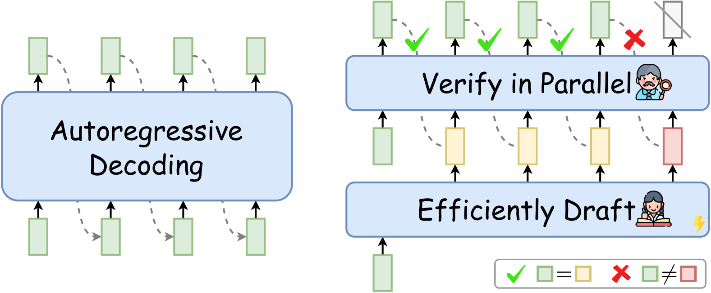

图1 与顺序生成的自回归解码（左）不同，推测解码（右）首先有效地起草多个token，然后使用目标LLM并行验证它们。分叉位置后的草稿token将被丢弃，以保证生成质量。

推测解码基于关于LLM推理的两个关键观察结果：1）许多简单的token可以用较少的计算开销（例如使用较小的模型）进行预测；2）LLM推理具有高度的内存带宽限制，主要的延迟瓶颈来自LLM参数的内存读写，而不是算术计算。根据这些观察结果，推测解码采用了推测执行的概念，将LLM的工作重点放在预先起草的token的验证上，大大减少了对LLM参数频繁内存操作的需求，从而提高了推理效率。

> 推测执行（[Burton，1985](https://ieeexplore.ieee.org/document/6312218)；Hennessy和Patterson，2012）是一种用于计算机体系结构的优化技术，其中任务提前执行，然后验证其必要性，从而避免顺序任务执行中固有的延迟。

虽然推测解码显示出前景，但它提出了几个关键问题，值得进一步调查。例如，如何设计最佳的起草器，以在推测准确性和起草效率之间取得平衡。此外，评估验证标准是否能够保持生成并行性和输出质量也是至关重要的。此外，由于现有方法是在不同的测试条件下进行评估的，因此需要一个统一的基准来衡量实际的加速预期。

随着推测解码研究的迅速发展，这项工作首次尝试对该领域进行调查，旨在提高学术界对最新进展的认识。我们对当前的研究进行了系统的分类，并对相关研究进行了深入分析。此外，我们还介绍了Spec-Bench，这是一个全面的基准，用于评估各种应用场景中的推测解码方法。我们的贡献总结如下：

（1）**第一个综述：** 据我们所知，我们是第一个对推测解码进行全面调查的人。

（2）**形式定义：** 我们提供了推测解码的形式定义和公式，为未来的研究奠定了基础。

（3）**新的分类法：** 我们为推测解码提供了一个系统的分类法，提供了对现有工作的有组织的分类。

（4）**Spec-Bench：** 我们介绍了Spec-Bench，这是一个广泛的基准测试，旨在评估推测解码，从而能够对先进的方法进行比较评估。

我们希望这项工作能成为新来者的重要指南，并激励未来的研究。

## 2 概述

本文对推测解码进行了全面的综述。我们首先介绍推测解码研究的早期阶段（§3），通过其演变的时间表来说明（如图2所示）。接下来是推测解码的正式定义和公式（§4）。然后，我们深入研究了先进技术的详细讨论，包括模型草案的选择（§5）、验证策略（§6）以及起草器和目标LLM之间的一致性（§7）。此外，我们还介绍了Spec-Bench，这是一个广泛的评估基准，旨在评估推测解码的加速效果（§8）。

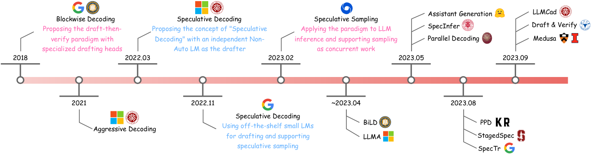

图2 推测解码演变的时间线。2022年后，推测解码作为一种通用的解码范式被正式引入，以加速LLM推理，并引起了广泛关注。

## 3 推测解码的演变

本节讨论了推测解码背后的动机（§3.1），然后详细介绍了该领域的早期尝试（§3.2）。

### 3.1 动机

LLM的广泛采用已经将自回归解码确立为LLM推理的事实标准。然而，自回归解码受到其推理延迟的限制，这主要源于LLM的内存限制（memory-bound）。具体而言，每个解码步骤的主要延迟瓶颈不是由于计算操作，而是由于需要将所有LLM参数从高带宽存储器（HBM）传输到GPU等现代加速器的片上高速缓存。这个过程每一步只生成一个token，导致这些加速器的利用不足，并导致效率低下。

### 3.2 早期*先起草后验证* 尝试

为了缓解上述问题，一种直观的方法涉及利用空闲的计算资源来增强LLM推理中的并行性。为此，[Stern等人（2018）](https://arxiv.org/pdf/1811.03115)引入了分块解码（Blockwise Decoding），这是一种在Transformer解码器顶部结合额外前馈神经（FFN）头的方法，能够每一步同时起草多个token。然后，这些token由原始LLM并行验证，确保输出与原始LLM的输出一致。作为提出*先起草后验证* 范式的开创性工作，分块解码通过提高生成并行性，有效地减少了所需LLM调用的数量，从而加速了推理。

为了进一步释放这种范式的潜力，[Xia等人（2023）](https://arxiv.org/pdf/2203.16487)引入了推测解码（SpecDec），它利用一个独立的起草器（专门的非自回归Transformer）准确高效地执行起草任务。此外，该方法提出了一种创新策略，放宽了严格的验证标准，从而提高了起草token的接受率。令人印象深刻的是，SpecDec以相当的质量实现了约5倍的自回归解码加速，突显了推测解码的巨大潜力。

继SpecDec之后，[Leviathan等人（2023）](https://arxiv.org/pdf/2211.17192)和[Chen等人（2023a）](https://arxiv.org/pdf/2302.01318)同时提出了推测采样，将这一范式扩展到包括各种采样方法的无损加速。这些方法采用了来自同一系列的较小LMs（例如T5 small），以加快对其较大模型（例如T5-XXL）的推断。与之前的工作不同，这些现成的小型LMs不需要额外的训练，从而能够在LLM加速中快速采用推测解码。这一进步将推测解码提升到LLM效率研究的前沿，吸引了NLP社区的广泛兴趣。

总之，这些在推测解码方面的开创性努力已经逐渐巩固了*先起草后验证* 范式，展示了其在LLM加速方面的巨大潜力。我们将在以下章节中对这些研究和后续研究进行详细的分类和讨论。

## 4 公式和定义

在本节中，我们首先简要概述了标准自回归解码（§4.1）。然后，我们对推测解码进行了深入的阐述（§4.2），其中包括形式定义、方法的全面描述和算法的详细阐述。

### 4.1 自回归解码

基于Transformer的LLM通常以自回归的方式生成。给定输入序列$x_1,...,x_t$，自回归语言模型$\mathcal{M}_q$根据以下公式生成下一个token：

$$
\begin{equation}x_{t+1}\sim q_{t+1}=\mathcal{M}_q(x|x_{< t+1})\end{equation}
$$

其中$q$是由$\mathcal{M}_q$计算的条件概率分布，$x_{t+1}$表示从$q_{t+1}$采样的下一个token。我们在算法1中说明了一个详细的过程。

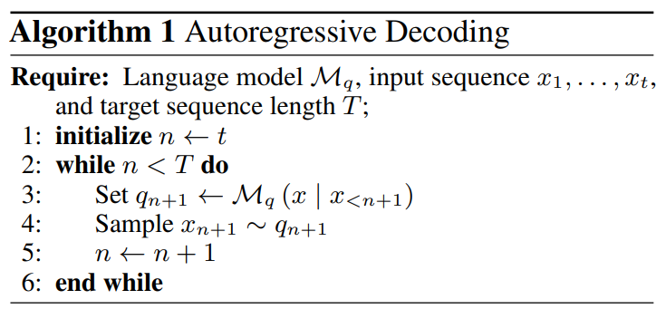

如第3节所述，虽然标准自回归解码提供了理想的生成质量，但它受到内存带宽的限制，导致现代加速器的利用率较低。在这个过程中，每个内存限制的LLM调用（即LLM前向推理）只为整个序列生成一个token，这使得整个生成效率低下且耗时。

### 4.2 推测解码

继Xia等人（2023）、Leviathan等人（2022）和Chen等人（2023a）之后，我们在这里提供了推测解码的正式定义：推测解码是一种*先起草后验证* 解码范式，在每个解码步骤，它首先有效地起草多个未来token，然后使用目标LLM并行验证所有这些token，以加快推理。

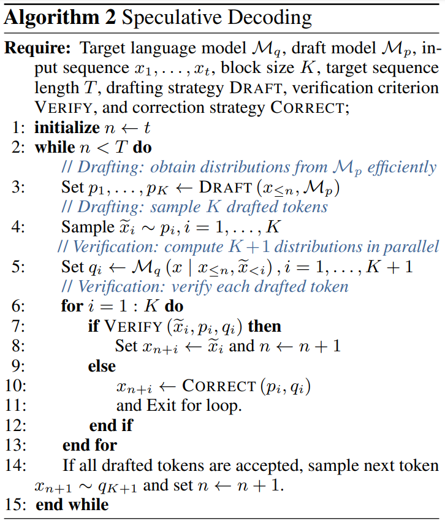

我们在算法2中制定了一个详细的推测解码过程。随后，我们深入研究了这一范式不可或缺的两个基本子步骤 - 起草和验证：

**起草（Drafting）** 在每个解码步骤，推测解码首先有效地起草多个未来token，作为对目标LLM输出的推测。形式上，给定一个输入序列$x_1,...,x_t$和目标LLM $\mathcal{M}_q$，该范式采用有效的草稿模型$\mathcal{M}_p$（例如，较小的LM）来解码接下来的$K$个草稿token：

$$
\begin{equation}p_1,...,p_K=\mathtt{DRAFT}(x_{\leq{t}},\mathcal{M}_p),\ \tilde{x}_i\sim{p_i},\ i=1,...,K\end{equation}
$$

其中，$\mathtt{DRAFT}(\cdot)$表示我们将在第5节中讨论的各种起草策略，$p$是由$\mathcal{M}_p$计算的条件概率分布，$\tilde{x}_i$表示从$p_i$采样的起草token。
**验证（Verification**） 随后，这些起草的token由目标LLM $\mathcal{M}_q$并行地验证。形式上，给定输入序列$x_1,...,x_t$和草稿$\tilde{x}_1,...,\tilde{x}_K$，推测解码利用$\mathcal{M}_q$同时计算$K+1$个概率分布：

$$
\begin{equation}q_i=\mathcal{M}_q(x|x_{\leq t},\tilde{x}_{<i}),\ i=1,...,K+1\end{equation}
$$

然后，通过特定标准$\mathtt{VERIFY}(\tilde{x}_i,p_i,q_i)$来验证每一个起草的token $\tilde{x}_i$。只有那些符合标准的token才会被选择作为最终输出，从而确保质量与目标LLM的标准一致。否则，未通过验证的第一个起草的token $\tilde{x}_c$将通过策略$\mathtt{CORRECT}(p_c,q_c)$进行更正。位置$c$之后的所有起草的token都将被丢弃，以保证最终输出的高质量。如果所有token都通过验证，则将从$q_{K+1}$中采样额外的token $x_{t+K+1}$，如等式（1）所示。
起草和验证子步骤将被迭代，直到满足终止条件，即解码到$[EOS]$ token或句子达到最大长度。

值得注意的是，推测解码的加速效应主要取决于每一步起草token的*接受率（the acceptance rate）*。这一比率受到几个因素的影响，包括草稿质量、验证标准以及起草器和目标LLM之间的行为一致性。此外，起草器本身的内在效率也有助于整体加速。在接下来的章节中，我们将深入研究推测解码的这些关键组成部分，如图3所示，以系统地对这一有前景的范式中的最新研究趋势进行分类。

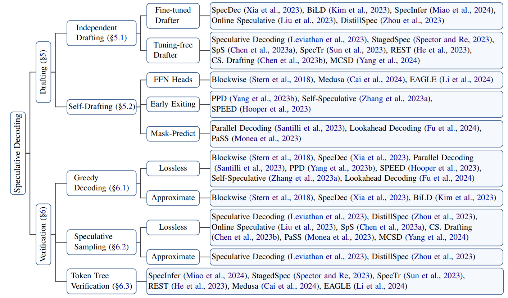

图3 推测解码的分类

## 5 起草

作为推测解码的重要组成部分，起草过程对加速有着至关重要的影响。影响由两个关键因素决定：起草器$\mathcal{M}_p$的推测准确性（以每步接受token的平均数量衡量）和起草延迟（Stern，2018；Xia，2023）。如何权衡高推测准确性和低起草延迟是这一过程中的一个重大挑战。在本节中，我们将各种起草策略分为两类：独立起草（§5.1）和自起草（§5.2），并在表1中总结其公式$\mathtt{DRAFT}(x_{\leq t},\mathcal{M}_p)$。

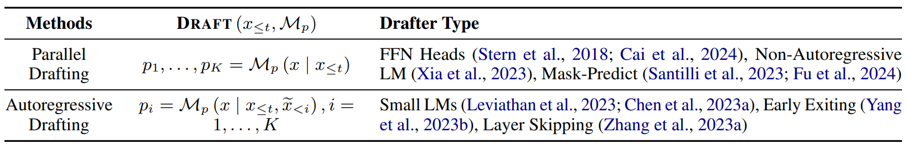

表1 推测解码中各种起草策略的公式总结。我们根据它们的公式将这些方法分为两组：并行起草和自回归起草。

### 5.1 独立起草

为了在推测准确性和效率之间取得平衡，SpecDec首次提出使用独立模型进行起草。具体来说，它使用了一个专门的非自回归Transformer，每个步骤同时起草多个token。该模型具有深度浅（deep-shallow）的编码器-解码器架构以高效运行。尽管SpecDec具有优势，但它需要从头开始训练草稿模型，这需要增加计算预算。

考虑到现有LLM系列中的可用模型（例如OPT和LLaMA），一种更直接有效的方法是直接使用来自同一系列的小模型作为起草器来加速其较大模型的推理（Leviathan，2023；Chen，2023a；[Spector，2023](https://arxiv.org/pdf/2308.04623)；[Sun，2023](https://arxiv.org/pdf/2310.15141)；[Chen，2023b](https://arxiv.org/pdf/2312.11462)）。例如，Leviathan等人（2023）利用T5 small作为起草器，加速了T5-XXL的推理。这些现成的小模型不需要额外的训练或对模型架构进行任何修改，有助于快速采用推测解码。此外，由于同一系列中的模型共享分词器、预训练语料库和类似的训练过程，因此它们在预测行为方面具有内在的一致性。

### 5.2 自起草

虽然利用外部草稿模型提供了相当大的优势，但这种方法需要额外的努力来训练或确定与目标LLM密切一致的草稿模型。当LLM的较小模型不可用时，例如LLaMA-7B，这种挑战会加剧。此外，在单个系统中集成两个不同的模型会带来额外的计算复杂性，特别是在分布式环境中。

为了解决上述问题，许多研究建议利用目标LLM本身进行有效的起草（Stern，2018；[Santilli，2023](https://arxiv.org/pdf/2305.10427)；Hooper，2022；Cai，2024；[Fu，2024](https://arxiv.org/pdf/2402.02057)；[Du，2024](https://arxiv.org/pdf/2402.02082)）。特别是，分块解码和[Medusa（Cai，2024）](https://arxiv.org/pdf/2401.10774)在Transformer解码器上集成了FFN头，实现了每一步的并行token生成。与外部起草器相比，这些轻量级的头减少了额外的计算开销，并且对分布式推理很友好。另一条研究路线探索了在起草的目标LLM中*提前退出（early exiting）*和*跳跃层（layer skipping）*的潜力（Yang，2023b；Zhang，2023a；[Hooper，2023](https://arxiv.org/pdf/2310.12072)）。例如，[Yang等人（2023b）](https://arxiv.org/pdf/2307.05908)引入了在当前解码步骤中提前退出的额外子流程，从而提前启动未来token的起草。类似地，[Self-Speculative（Zhang，2023a）](https://arxiv.org/pdf/2309.08168)提出在推理过程中自适应地跳过几个中间层，以有效地起草。

与之前专注于扩展模型架构或改变推理过程的工作相反，Santilli等人（2023）引入了一种简单的起草策略，该策略直接将多个$[PAD]$ token附加到输入提示的末尾，以实现并行生成。然而，这种方法偏离了LLM的自回归预训练模式，导致起草质量不理想。为了解决这一问题，Fu等人（2024）提出将低质量的草稿转换为多个n-gram，以提高推测的准确性；[Monea等人（2023）](https://arxiv.org/pdf/2311.13581)引入了多个可学习$[LA]$ token，并在小型训练数据集上对这些token嵌入进行了微调，以提高并行解码性能。

## 6 验证

在每个解码步骤中，并行验证起草的token，以确保输出与目标LLM对齐。这个过程还决定了每一步接受的token数量，这是影响加速的一个重要因素。本节总结了各种验证标准$\mathtt{VERIFY}(\tilde{x}_i,p_i,q_i)$（如表2所示），包括LLM推理中支持贪婪解码（§6.1）和推测采样（§6.2）的那些。此外，我们引入了 token树验证（§6.3），这是一种提高 token接受率的有效策略。

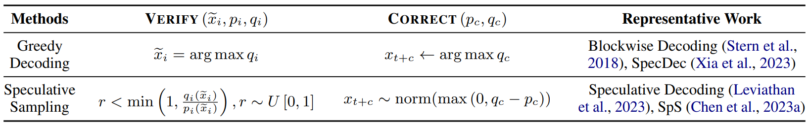

表2 推测解码中各种验证策略的公式总结。

### 6.1 贪婪解码

推测解码的早期尝试集中在支持贪婪解码的验证标准上，这保证了输出与目标LLM的贪婪解码结果完全相同（Stern，2019；Sun，2021；Xia，2023）。形式上，给定输入序列$x_1,...,x_t$，起草的token$\tilde{x}_1,...,\tilde{x}_K$和从等式（2）和（3）分别计算出的概率分布$p_1,...,p_K,q_1,...,q_K$，第$i_{th}$个起草的token的验证标准公式化为

$$
\begin{equation}\tilde{x}_i=\mathtt{argmax}\ q_i\end{equation}
$$

其中$i=1,...,K$。起草的token $\tilde{x}_c$未通过验证的第一个位置$c$表示分叉位置。$x_{t+c}$位置处的输出token将通过校正策略进行调整，该校正策略简单地用LLM的top-1预测替换起草的token：

$$
\begin{equation}x_{t+c}=\mathtt{argmax}\ q_c\end{equation}
$$

贪婪解码的验证标准是简单明了的。因此，随后的多项研究都采用了这一标准来证明其方法的有效性（Santilli，2023；Yang，2023b；Hooper，2024；Zhang，2023a；Fu，2024）。然而，该标准的严格匹配要求往往会导致拒绝高质量的起草token，因为它们与目标LLM的top-1预测不同，从而限制了加速。

为了解决这个问题，多项研究提出了各种近似验证标准（Stern，2018；Xia，2023；[Kim，2023](https://arxiv.org/pdf/2302.07863)）。与无损标准相比，这些方法略微放宽了匹配要求，以更加信任草稿，从而提高了对草稿token的接受度。例如，SpecDec只要求起草的token属于目标LLM的top-k候选者；[BiLD（Kim，2023）](https://arxiv.org/pdf/2302.07863)提出了一种回滚标准，该标准仅在连续不匹配token的数量超过固定阈值时拒绝起草的token。

### 6.2 推测采样

继Stern等人（2019）之后，随后的工作扩展了推测解码，以支持各种采样方法（Leviathan，2023；Chen，2023a），在不改变其输出分布的情况下加速了目标LLM的推理。形式上，给定初始序列$x_1,...,x_t$，起草的令牌$\tilde{x}_1,...,\tilde{x}_K$和计算出的分布$p_1,...,p_K,q_1,...,q_K$，第$i_{th}$个起草的token的验证标准为

$$
\begin{equation}r<\mathtt{min}\left(1,\frac{q_i(\tilde{x}_i)}{p_i(\tilde{x}_i)}\right),r\sim U[0,1]\end{equation}
$$

其中$r$表示从均匀分布$U[0,1]$中提取的随机数；$q_i(\tilde{x}_i)$和$p_i(\tilde{x}_i)$分别是$\tilde{x}_i$在$\mathcal{M}_q$和$\mathcal{M}_p$上的概率；并且$i=1,...,K$。换句话说，如果$q_i(\tilde{x}_i)\geq p_i(\tilde{x}_i)$，这种标准接受token $\tilde{x}_i$；如果$q_i(\tilde{x}_i)<p_i(\tilde{x}_i)$
，就以$1-\frac{q_i(\tilde{x}_i)}{p_i(\tilde{x}_i)}$的概率拒绝这个token。校正策略从调整后的分布对分叉位置$c$处的输出token重新采样：

$$
\begin{equation}x_{t+c}\sim\mathtt{norm}(\mathtt{max}(0,q_c-p_c))\end{equation}
$$

Leviathan等人（2023）和Chen等人（2023a）从理论上证明了该标准与目标LLM保持相同的输出分布。因此，它在随后的研究中被广泛采用（[Liu，2023](https://arxiv.org/pdf/2310.07177)；[Zhou，2023](https://arxiv.org/pdf/2310.08461)；Monea，2023年；Chen，2023b）。除了严格的要求外，一些工作还探索了提高token接受率的近似策略（Leviathan，2023；Zhou，2023）。例如，Leviathan等人（2023）提出将等式（6）中的$p_i(\tilde{x}_i)$乘以参数$l\in[0,1]$，以稍微放宽标准。

### 6.3 Token树验证

与之前专注于单个草稿序列的验证策略相反，[SpecInfer（Miao，2024）](https://arxiv.org/pdf/2305.09781)提出了*token树验证（token tree verification）*，这是一种有效的策略，使目标LLM能够并行验证多个草稿序列。如图4所示，该方法首先通过共享前缀将多个候选草稿序列合并到一个token树中。然后，它利用专门设计的树注意力掩码来促进LLM并行验证整个结构。最近的研究探索了获得这些候选草稿序列的各种方法（Miao ，2024；Cai，2024；[He，2023](https://arxiv.org/pdf/2311.08252)；[Li，2024](https://arxiv.org/pdf/2401.15077)）。例如，Miao等人（2024）从不同的boost-tuned LMs产生了不同的草稿序列；Cai等人（2024）考虑了来自每个FFN头的前k个预测，以获得多个候选序列。

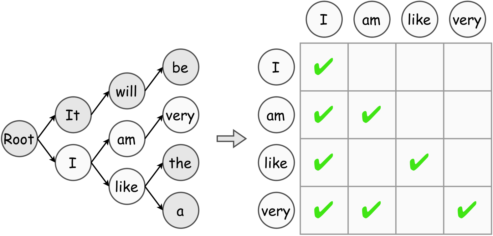

图4 token树序列（左）和树注意力掩码（右）的图示。为了简单起见，我们用白色只可视化token的注意力掩码。

## 7 对齐

如第5节所示，推测解码的加速主要取决于推测的准确性，而推测的准确性又受到起草器和目标LLM之间行为相似性的影响。为了加强这一点，现有研究探索了各种知识蒸馏（KD）策略，以使起草器的产出与目标LLM的产出保持一致（Stern，2018；Xia，2023；Miao，2024；Liu，2023；Kim，2023；Zhou，2023）。特别是，分块解码采用了序列级知识蒸馏（Seq-KD）进行对齐，在目标LLM生成句子上对起草器进行训练。Miao等人（2024）提出了一种collective boost-tuning（Col-BT）策略，应用Seq-KD对训练数据上的多个小LMs进行微调，并将其聚合输出作为草稿来提高推测精度。

尽管Seq-KD是有效的，但它忽略了目标LLM的概率分布，导致采样方法的性能下降。为了纠正这一点，最近的研究探索了用于推测解码的其他KD策略（Zhou，2023；Liu，2023）。值得注意的是，[DistillSpec（Zhou，2023）](https://arxiv.org/pdf/2310.08461)在各种下游任务中对推测解码的不同KD策略进行了全面比较。[Liu等人（2023）](https://arxiv.org/pdf/2310.07177)提出了一种在线KD策略，该策略使用查询数据动态地将起草器与目标LLM对齐。

我们在表3中总结了现有推测解码方法的主要特征，包括起草器类型或起草策略、对齐方法、支持的验证策略和报告的加速等。

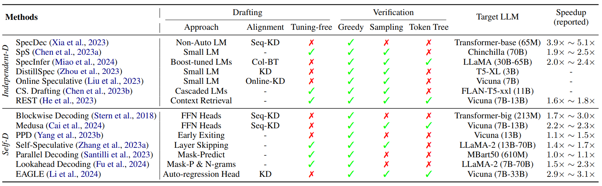

表3 推测性解码方法概述。“*Independent-D*”和“*Self-D*”分别表示独立起草和自起草。“*Greedy*”、“*Sampling*”和“*Token Tree*”分别表示该方法是否支持贪婪解码、推测采样和token树验证。我们列出了原始论文（如有报道）中每种方法和加速的最具代表性的目标LLM。

## 8 Spec-Bench

随着推测解码研究的快速发展，对先进方法的比较分析需求越来越大。然而，现有的方法是使用不同的基准、设备和环境进行测试的，这使得公平的比较不切实际。为了解决这一差距，我们引入了Spec-Bench，这是一个涵盖各种应用场景的推测解码的综合基准。基于Spec-Bench，我们对第三方测试条件下的开源方法进行了系统的比较。实验在相同的设备和测试环境上进行，以确保公平的比较。

### 8.1 基准构建

为了评估各种场景下的推测解码方法，Spec-Bench包含六个不同的子任务：多轮对话、翻译、摘要、问答、数学推理和检索增强生成。我们通过从六个广泛使用的数据集中随机选择80个实例组成了Spec-Bench，包括MT-Bench、WMT14 DE-EN、CNN/Daily Mail、Natural Questions、GSM8K和DPR。有关Spec-Bench和具体实验设置的详细信息，请参阅附录B。

### 8.2 比较评估

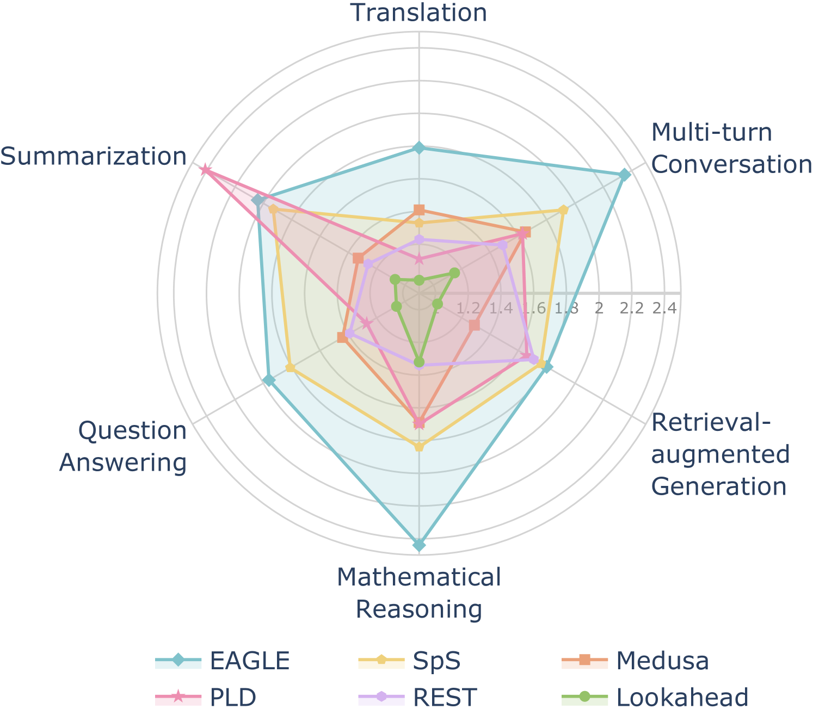

图5 在具有贪婪设置（T=0）的Spec-Bench上加速各种推测解码方法的比较。使用Vicuna-7B在批次大小为1上评估。我们给出了运行3次的平均加速。详细结果见附录C。

我们的主要评估是使用单个消费级3090 GPU在FP16精度的Vicuna-7B上进行的。如图5所示，在贪婪设置下，[EAGLE（Li，2024）](https://arxiv.org/pdf/2401.15077)在大多数子任务中实现了最高的加速比（1.8×～2.4×），超过了自回归解码，尤其是在数学推理中（具有～2.4×的加速比）。EAGLE的成功主要归功于两个因素：1）它重用LLM的KV缓存来预测起草token，大大减少了起草的计算开销；2） 与[Medusa（Cai，2024）](https://arxiv.org/pdf/2401.10774)相比，EAGLE以自回归的方式起草，提供了更稳定、更准确的推测结果。[PLD（Saxena，2023）](https://github.com/apoorvumang/prompt-lookup-decoding/)擅长于输入和输出之间具有高度相似性的子任务，例如摘要（具有~2.4×的加速）。然而，它在翻译和问答等其他子任务中的性能有所下降，加速比在1.1×～1.3×之间。

我们还比较了推测解码方法在不同采样温度下的加速效果。如图6所示，EAGLE在各种设置中始终优于其他方法，实现了1.7×至2.1×的加速比。此外，观察到所有方法的加速效应都随着采样温度的升高而减小。这归因于在更高温度下推测采样标准的计算复杂性增加，如先前的研究所揭示的（[Joao Gante，202](https://huggingface.co/datasets/joaogante/assisted_generation)3；Spector，2023）。

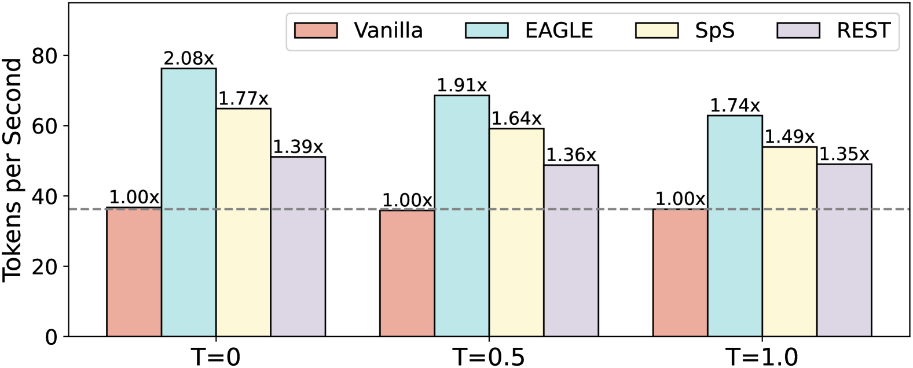

图6 在不同温度下，在Spec-Bench各种方法的加速比较。加速效应随着采样温度的升高而减小。

## 9 挑战和未来方向

**如何权衡推测的准确性和起草效率？** 如第5节所述，扩大起草器的规模可以有效地提高推测的准确性，但它在很大程度上降低了起草效率，甚至降低了总体速度。因此，必须在推测准确性和起草延迟之间取得平衡。在现有的策略中，行为对齐是解决这一问题的一种很有前途的方法，因为它在不增加延迟的情况下提高了推测的准确性。然而，尽管最近取得了进展（Miao，2024；Zhou，2023；Liu，2023），在使起草器与目标LLM保持一致方面仍有相当大的改进空间。例如，假设分叉位置后起草的token都被丢弃，一个潜在的方向可能涉及鼓励起草器优先考虑早期位置token的生成质量。除了对齐之外，其他因素，如起草质量（Fu，2024）和推测长度的确定（[Su，2023](https://arxiv.org/pdf/2310.18813)）也会影响推测的准确性，值得进一步探索。

**如何在批量推理场景中应用推测解码？** 目前，只有少数推测解码实现支持批量推理，如[EAGLE](https://github.com/SafeAILab/EAGLE)和[SpS](https://github.com/lucidrains/speculative-decoding)。然而，在LLM实时服务中，批量推理是有效管理用户输入的关键技术。批量推测解码的主要挑战在于两个方面：（1）由于推测准确率的不同，推测解码中每个解码句子的解码步骤不同。因此，一个批次的推理延迟取决于该批次中最慢的样本；（2） 推测解码引入的额外计算复杂度，尤其是在采样设置中，会随着批量大小的增加而增加。如何在批量推理中保持推测解码的加速，并将其与连续批处理（continuous batching）（[Yu，2022](https://www.usenix.org/conference/osdi22/presentation/yu)）等先进技术相结合，值得进一步研究。

**如何将推测解码与其他先进技术相结合？** 作为一种通用的解码范式，推测解码已经与其他先进技术相结合，展示了其潜力（Yang，2023a；Zhang，2023b；Li，2023）。例如，[Yuan等人（2023）](https://arxiv.org/pdf/2311.08981)将推测解码与对比解码（Contrastive Decoding）（[Li，2023](https://aclanthology.org/2023.acl-long.687/)）相结合，不仅加快了推理速度，而且大大提高了生成质量。除了加速纯文本LLM之外，将推测解码应用于多模态推理，如图像合成、文本到语音合成和视频生成，也是未来研究的一个有趣而有价值的方向。另一个有前景的研究方向是将推测解码与其他有效方法相结合，如vLLM（[Kwon，2023](https://arxiv.org/pdf/2309.06180)）、Non-Autoregressive Generation（[Du，2021](https://arxiv.org/pdf/2106.05093)，[2022](https://arxiv.org/pdf/2210.03999)）和Flash-Attention（[Dao，2022](https://arxiv.org/pdf/2205.14135)；[Dao，2023](https://arxiv.org/pdf/2307.08691)），进一步提高LLM服务的推理效率。

## 10 总结

本文对推测解码进行了全面的综述，包括这一有前景的范式的演变、其形式化定义和公式、对现有方法的系统分类，以及对先进技术的深入回顾。此外，我们还介绍了Spec-Bench，一个用于推测解码方法的广泛评估基准，并对突出的方法进行了比较评估。据我们所知，这是第一次专门针对推测解码的调查。我们撰写本文的目的是澄清当前的研究前景，并为未来的研究方向提供见解。

## 局限性

本文对推测解码的当前方法和新兴趋势进行了全面的研究和分类。我们还对先进的开源方法进行了比较分析，以使研究人员更深入地了解不同模型的优势和局限性。除了推测解码之外，我们还承认其他有效的NLP策略，如vLLM和连续批处理。在未来，我们打算扩大讨论范围，将推测解码与这些先进技术相结合。此外，由于缺乏批量推测解码的可用实现，我们的评估无法涵盖这一方面。我们计划进行后续实验，以评估各种批量大小的推测解码方法的加速效果。

# 附录

## A 应用

除了作为一种通用范式外，最近的工作还表明，推测解码的一些变体在特定任务中表现出非凡的有效性。此外，其他研究已经将这种范式应用于解决某些应用场景特有的延迟问题，从而实现推理加速。下面，我们将对这些有前景的工作进行详细介绍。

最近的研究指出，推测解码特别适合于模型输入和输出高度相似的任务（Sun，2021；[Ge，2022](https://arxiv.org/pdf/2205.10350)；Yang，2023a），如语法纠错和检索增强生成。这些方法引入了一种专门形式的推测解码，其中直接使用初始用户输入或检索到的上下文作为草稿。例如，[SAD（Sun，2021）](https://arxiv.org/pdf/2106.04970)是语法纠错推测解码的早期尝试，它利用有语法错误的输入句子作为草稿，并利用LLM并行验证整个句子，实现了9×～12×加速。同样，[LLMA（Yang，2023a）](https://arxiv.org/pdf/2304.04487)选择了参考文献中的文本作为草稿，展示了在各种实际应用场景中的2×～3×加速，包括索增强生成、缓存辅助生成和多轮对话。

除了这些工作之外，[RaLMSpec（Zhang，2023b）](https://arxiv.org/pdf/2401.14021)还采用了推测解码来加速检索增强语言模型（RaLMs）。它指出迭代RaLMs的主要延迟瓶颈是从庞大的知识库中频繁检索。为了加速推理，该方法建议维护一个本地缓存用于推测检索，在相同的模型输出下实现约2倍的加速。[LLMCad（Xu，2023）](https://arxiv.org/pdf/2309.04255)将推测解码应用于设备上LLM推理。具体地说，它建议用较小的实时LM生成草稿，该草稿可以托管在设备内存中，并且只利用目标LLM进行并行验证。这种方法有效地减少了模型权重的重复释放和加载，与现有的推理引擎相比，实现了9.3倍的加速。

## B 实验细节

### B.1 Spec-Bench详细信息

为了评估推测解码方法在各种场景中的加速性能，我们开发了Spec-Bench，这是一个包含六个不同任务的综合基准。Spec-Bench集成了MT-Bench，这是一种以前在研究中采用的多轮对话基准，为与早期研究进行比较提供了基础。此外，它还包括两个输入引导任务：摘要和检索增强生成（RAG），两者在输入提示和目标输出之间都表现出显著的重叠。我们选择了CNN//Daily Mail和Natural Questions分别作为这两项任务的数据集。具体而言，在RAG子任务中，将从DPR检索到的前5个文档与每个问题连接起来，以构建输入提示。

此外，Spec-Bench还包含了三个子任务 - 翻译、问答和数学推理，以全面评估推测解码在不同环境中的加速能力。我们分别使用WMT14 DE-EN、Natural Questions和GSM8K作为这些任务的主要数据集。我们从每个子任务的测试集中随机选择80个实例进行评估。详细组成汇总见表4。

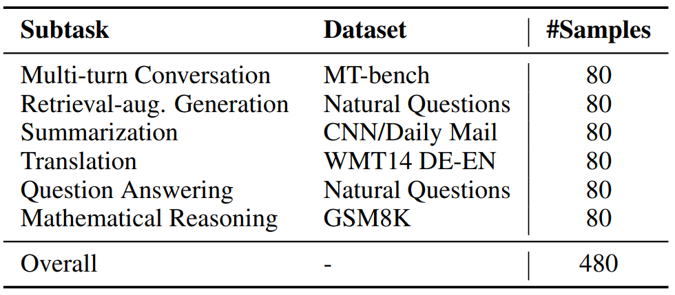

表4 Spec-Bench的详细组成。Spec-Bench包括6个子任务，涵盖不同的应用场景。

### B.2 实现细节

我们选择了六种具有代表性的推测解码方法在Spec-Bench上进行比较分析。这些方法是开源的，没有bug。具体而言，SpS是该领域的开创性工作，利用与起草器相同模型系列中的较小LM来加速LLM推理。Medusa和EAGLE将额外的轻量头集成到目标LLM中，以促进高效起草。[Lookahead](https://github.com/hao-ai-lab/LookaheadDecoding)在输入提示的末尾引入多个特殊标记，用于并行起草，并将草稿转换为n-gram候选者。[PLD](https://github.com/apoorvumang/prompt-lookup-decoding)是LLMA的代码实现，它从输入中选择文本作为草稿。[REST（He，2023）](https://arxiv.org/pdf/2311.08252)基于输入提示从文本语料库中检索相关草稿。

我们使用Vicuna-v1.3模型系列进行了实验评估。对于SpS，我们采用了[Huggingface](https://huggingface.co/blog/assisted-generation)实现，并使用了Yang等人提供的vicuna-68m-v1.3模型作为起草器。我们遵循Lookahead和PLD的默认参数进行评估。主要实验使用Pytorch 2.0.1进行，使用CUDA 11.8下的12个CPU核的单个消费级NVIDIA GeForce RTX 3090 GPU（24GB）。在CUDA 11.4下，对64个CPU核的更强大的NVIDIA A100 GPU（80GB）进行了进一步的分析。

## C 主要实验结果的细节

我们主要分析的详细结果如表5所示，包括贪婪解码（T=0）和推测采样（T=1）的实验设置。研究结果表明，EAGLE在各种Spec-Bench子任务中表现出色，实现了1.6×至2.4×的总体加速。PLD在输入和输出有显著重叠的情况下显示出显著的效率。例如，PLD的加速比从问答子任务的1.27倍增加到检索增强生成子任务的1.66倍，突出了当输入包括相关文档时PLD的有效性。值得注意的是，大多数方法在翻译子任务上实现了次优加速。我们怀疑这是由于预训练语料库中可能缺乏多语言数据。

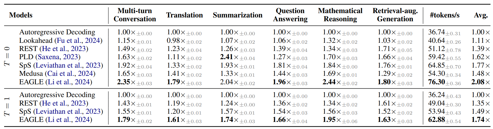

表5 在Spec-Bench上各种推测解码方法的加速比较。使用Vicuna-7B-v1.3以FP16精度获得结果。在批量大小为1的单个NVIDIA 3090 GPU上进行评估。我们报告了运行3次的平均加速比。我们以粗体显示最佳结果。

## D 在A100上的进一步分析

本节全面分析了Spec-Bench使用单个NVIDIA A100 GPU的主要推测解码方法。讨论了计算硬件、模型规模和计算精度对推测解码性能的影响。所有实验都是在相同的设备和环境下进行的，以确保公平的比较。

### D.1 计算设备

我们首先讨论了不断发展的计算设备对推测解码的影响。如图7所示，当在高性能GPU（如NVIDIA A100）上使用时，大多数推测解码方法的加速效果显著增强。这种增强主要是由于更先进的计算设备上空闲计算资源的可用性增加，推测解码可以利用这些资源来加速推理过程。在评估的方法中，Medusa和Lookahead表现出最显著的改进。具体而言，Medusa的加速比从1.48倍上升到2.42倍，而Lookahead的加速比则从1.11倍上升到1.77倍。这一发现强调，推测解码方法将从不断发展的计算硬件（如H100 GPU）中受益更多。

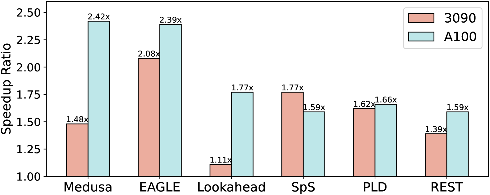

图7 Spec-Bench上各种方法与不同计算设备的加快比较。

我们在图8中说明了使用单个A100 GPU评估的各种推测解码方法的比较。详细的实验结果如表6所示。结果表明，Medusa和EAGLE在该实验环境中表现出色，实现了2.4倍的总体加速。这两种方法在多轮对话和数学推理子任务中表现特别好，速度提高了～2.8倍。

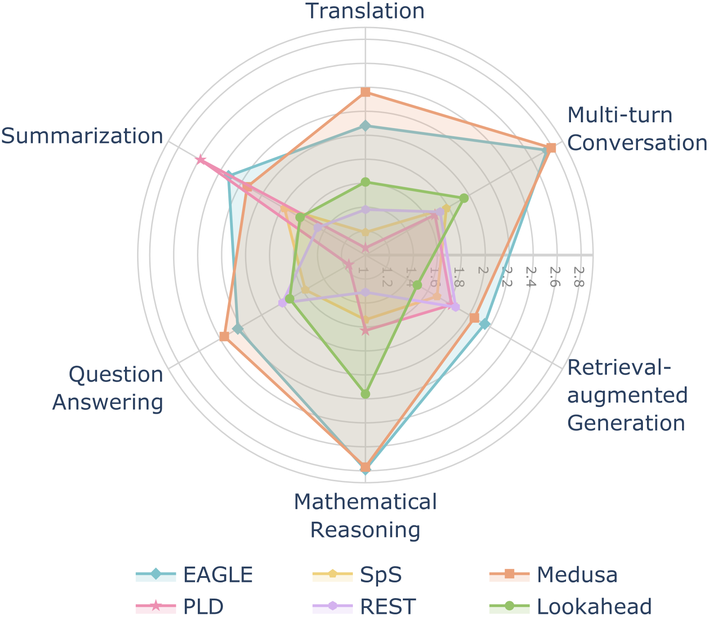

图8 在具有贪婪设置（T=0）的单个A100 GPU上各种推测解码方法的加速比较。在Spec-Bench上使用Vicuna-7B以FP16精度进行评估。

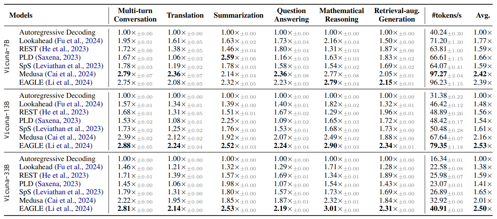

表6 ：在Spec-Bench上不同模型规模的推测解码方法的加速比较。使用Vicuna-v1.3在FP16精度和贪婪设置（T=0）下获得结果。在批量大小为1的单个NVIDIA A100 GPU上进行评估。我们报告了运行3次的平均加速。

### D.2 模型规模

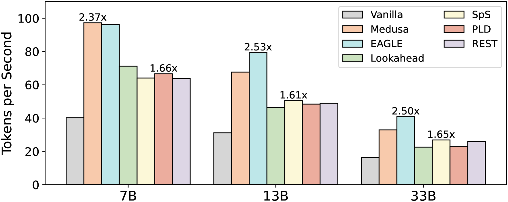

图9 Spec-Bench上各种方法不同模型尺度下的加速比较。

我们在图9中展示了不同模型规模的推测解码方法的加速比较。详细的实验结果如表6所示。在所有评估的方法中，EAGLE在所有模型尺度上都保持了高于自回归解码的高加速比，实现了2.4×至2.5×的加速比。虽然Medusa在Vicuna-7B上表现出优异的加速性能，但随着模型规模的增加，其加速比从2.4倍下降到2.0倍。

### D.3 计算精度

值得注意的是，大多数推测解码方法主要使用FP16精度进行评估。然而，需要强调的是，FP16精度的推测解码产生的输出可能与自回归解码得出的输出不一致。这种差异源于FP16计算中固有的浮点误差的累积，这可能导致两种解码方法的输出之间的差异，特别是在较长序列的情况下。在FP32精度中，推测解码的输出保证与自回归解码完全相同。

我们在图10中比较了推测解码方法与FP16/FP32精度的加速性能。实验结果表明，在FP32精度下，所有方法的加速速度都显著降低。具体而言，PLD在FP32精度上仅实现了1.01倍的加速，EAGLE的加速效应也有所减弱，其加速比从2.39倍降至1.74倍。为了让研究界全面了解加速影响，我们主张未来的研究报告两种精度设置下的加速指标。

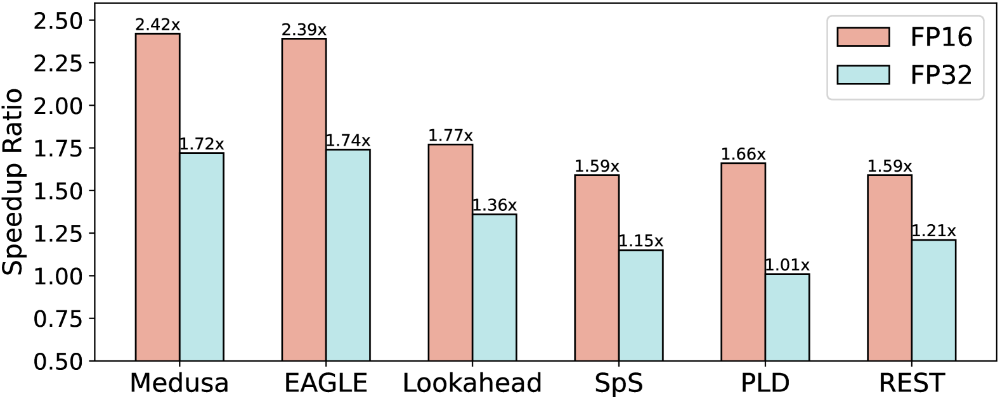

图10 Spec-Bench上各种方法的不同计算精度的加速比较
